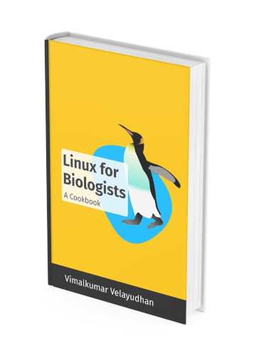
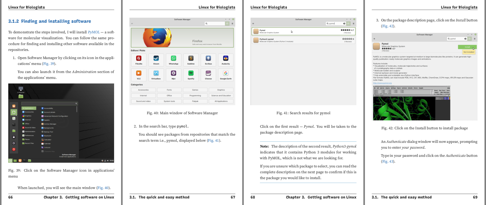
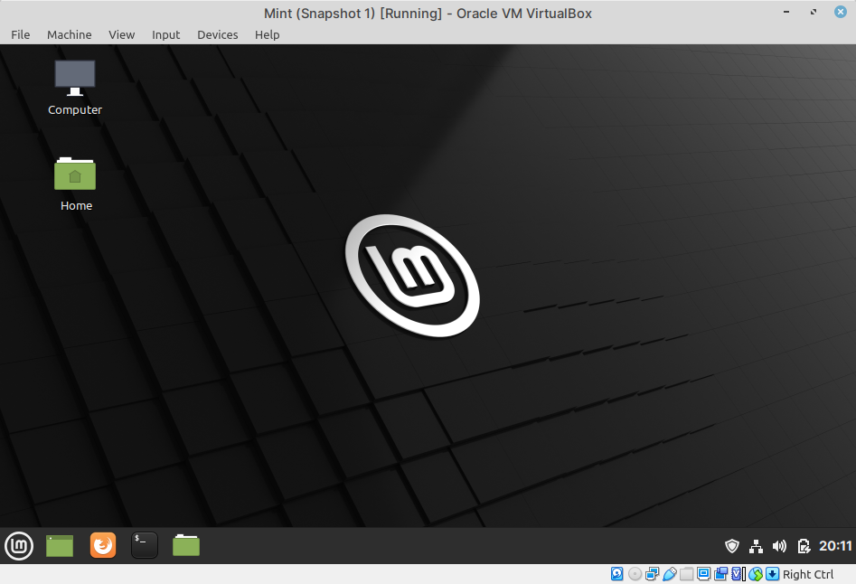
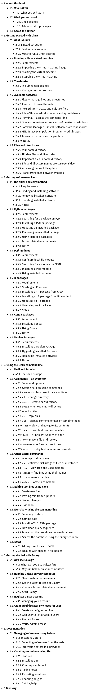

# Linux for Biologists — a cookbook
*A beginner's guide for students or researchers in biological 
sciences*. 

The primary focus of the book, is in using graphical user 
interfaces (GUIs) to accomplish tasks, but methods using the 
command line interface are also discussed.

<button>[Read it online](https://linuxforbiologists.readthedocs.io)</button>

## Support my work
By purchasing the ebook version in PDF and EPUB formats from:  
[Amazon](https://www.amazon.com/dp/B096YNSZ44), 
[Leanpub](https://leanpub.com/linuxforbiologists/) or
[Gumroad](https://gumroad.com/l/linuxforbiologists).

See the complete table of contents below.

## What you will learn 

Using this book, you will learn how to:

- Run Linux on your computer
- Use the desktop and included software
- Work with files and directories
- Search and install software
- Run some basic commands
- Run the Galaxy platform on your computer

## Includes over 120 screenshots

It will help you understand concepts quickly.

## Need help?

If you have any questions, you can post them in the 
[community forums](https://community.leanpub.com/c/linuxforbiologi). 

### Live support (online meeting)
If you would like to get support from me directly, you can 
[book an appointment](https://cloud.disroot.org/index.php/apps/appointments/pub/N07vfwBPuAEa/form)
for an online meeting on Jitsi Meet. 

There are *free support* slots daily, if you would like try before 
opting for paid support.

## Download virtual machine
If you do not have access to a Linux desktop, you can download 
a virtual machine image [using this link](https://sourceforge.net/projects/linuxforbiologists/files/linuxmint-20.1/linuxmint-20.1.ova/download).

This will help you run a virtual machine of Linux Mint 20.1 on your computer. 
All recipes in the book have been tested on this distribution.

After downloading, follow the **Running a Linux virtual machine** 
section in Chapter 2 of the book to get started.

This repository also includes the source code 
(Vagrant, Ansible) used to build the virtual machine 
image distributed along with this book.

## Table of contents

## License
* Linux for Biologists - A Cookbook:
  [Creative Commons Attribution-NonCommercial-ShareAlike 4.0 International](http://creativecommons.org/licenses/by-nc-sa/4.0/).

* Virtual machine:
  GPL v3
