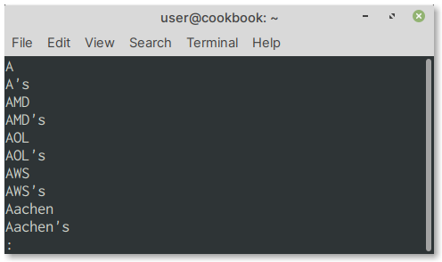

``less`` — view and navigate file contents
==========================================
With the ``less`` command, you have more control
when viewing a file. It allows you to scroll up and down
the file and provides features like searching the file
using keywords.

To view the contents of a file, use
``less``, followed by the name of the file:

.. code-block:: bash

   less /usr/share/dict/words

When the file is open, it will appear as in :numref:`fig-431`.

.. _fig-431:

   The ``words`` file open in ``less`` command

At the ``:`` prompt, you can type commands that less will
understand.

Navigating the file
-------------------
You can scroll down the file by pressing the 
:guilabel:`ENTER` key.

Alternatively, you can use the :guilabel:`PgUp` and 
:guilabel:`PgDn` keys to scroll one page at a time.

Searching the file
------------------
You can search a file while viewing it in ``less``.

To do this:

1. Type ``/`` (forward slash) key
2. Type the text you would like to search
3. Press the :guilabel:`ENTER` key
4. If there are matching results, they will be highlighted

Quitting the ``less`` command
-----------------------------
To quit the less command, type ``q`` at the prompt.
