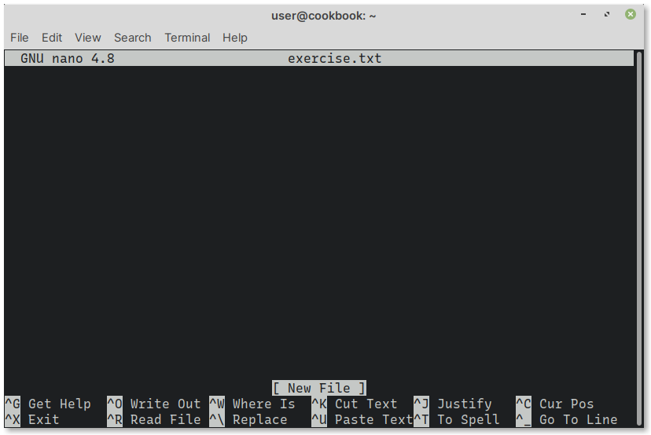

Create new file
===============
To create a new file, use ``nano`` followed by the name of
the file you would like to create.

For example:

.. code-block:: bash

   nano exercise.txt
   
This will open the file for writing (:numref:`fig-441a`).

.. _fig-441a:

   Creating a file in nano

You can start typing text at this stage.

