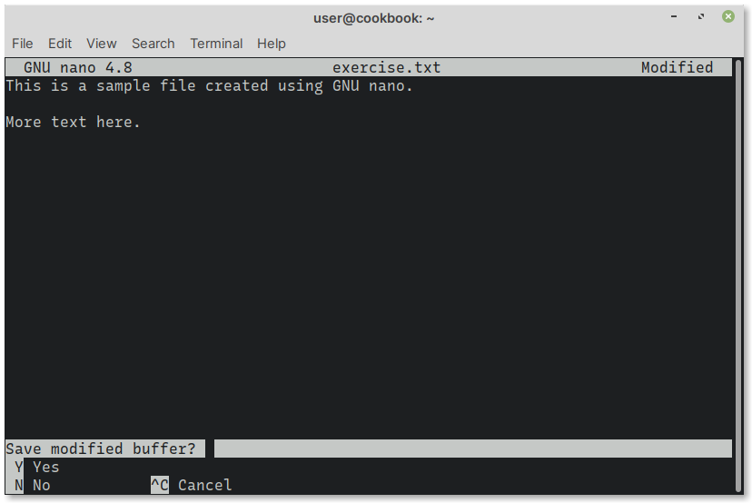

Exit nano
=========
To exit nano, use the ``Ctrl + x`` shortcut. 

If there are no changes, nano will close.
If there are unsaved changes, it will prompt 
you to save them (:numref:`fig-444a`).

.. _fig-444a:

   Confirmation to save changes to file

Type ``y`` to save changes or ``n`` to discard them.

