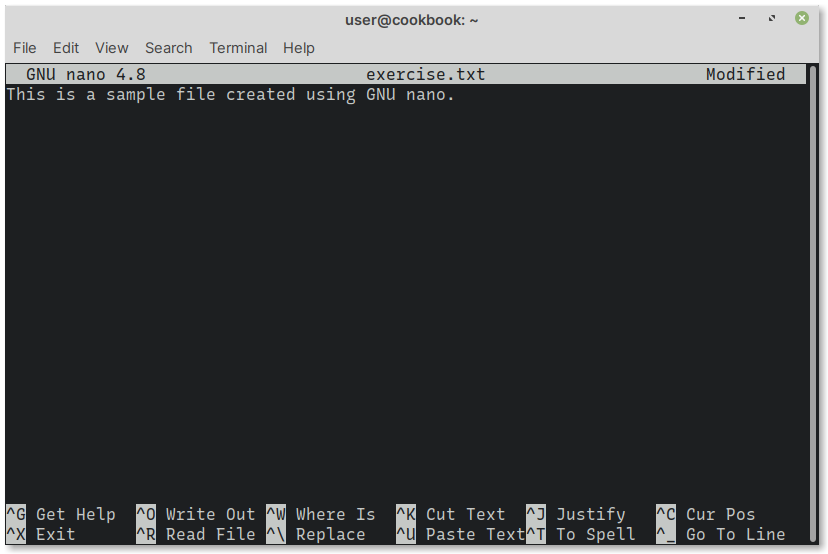
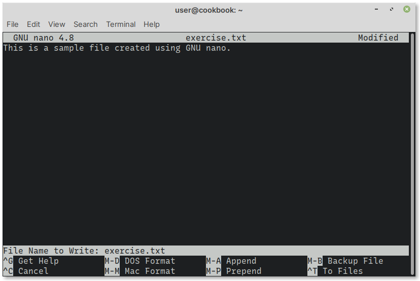

Saving changes
==============
To save the file, use the shortcut ``Ctrl + o``. 

This corresponds to the :guilabel:`^O Write Out` function 
displayed at the bottom (:numref:`fig-443a`). 
The :guilabel:`^` here refers to the ``Ctrl`` key.

.. _fig-443a:

   To save changes use the Write Out function

A prompt like the following will be displayed at the bottom
(:numref:`fig-443b`):

.. code-block:: console

   File Name to Write: exercise.txt
   
.. _fig-443b:

   Enter a file name to save the file
   
Press the :guilabel:`ENTER` key to accept the default value — 
the original file name.

