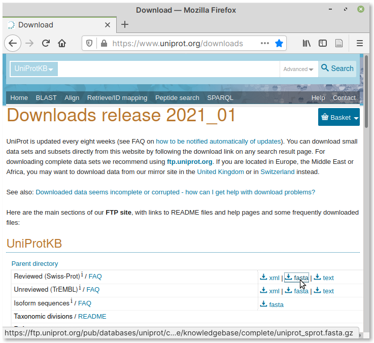

Download protein sequence database
==================================
You can follow these steps to download and prepare the
protein sequence database:

1. Create new directory
2. Change into it
3. Download the database archive
4. Uncompress (or extract) the database archive
5. Format the database

Create new directory — ``mkdir``
--------------------------------
In order to keep all BLAST databases in one location,
create a directory to store them using the
:doc:`mkdir <../commands/mkdir>` command:

.. code-block:: bash

   mkdir ~/databases

Change directory — ``cd``
-------------------------
Change into the newly created directory using the
:doc:`cd <../commands/cd>` command:

.. code-block:: bash

   cd ~/databases

Download the database archive — ``wget``
----------------------------------------
Visit the database downloads_ page on the UniProt website.

Navigate to the :guilabel:`UniProtKB` section.

Right-click on the fasta download link
corresponding to :guilabel:`Reviewed (Swiss-Prot)` and then
copy it to clipboard (:numref:`fig-451`).

.. _fig-451:

   Download link for Swiss-Prot database

To download the database, you can use the
``wget`` command with the link to download as the
argument:

.. code-block:: bash

   wget https://ftp.uniprot.org/pub/databases/uniprot/current_release/knowledgebase/complete/uniprot_sprot.fasta.gz

When the download is complete, you will find a file
named ``uniprot_sprot.fasta.gz`` in the current directory.
You can use the :doc:`ls <../commands/ls>` command to verify
if it exists:

.. code-block:: bash

   ls -lh

Output:

.. code-block:: console

   total 86M
   -rw-rw-r-- 1 user user 86M Feb 10 15:00 uniprot_sprot.fasta.gz

Since this file is in a compressed format (``.gz``),
you will need to uncompress it before proceeding.

Uncompress the database archive — ``gunzip``
--------------------------------------------
To uncompress (or extract) the database archive file
downloaded in the previous step, you can use the
``gunzip`` command.

.. note::

   By default, gunzip will remove the original
   compressed file after extraction.
   
   If you would like to keep the original file (``.gz``), 
   you can include the ``-k`` (keep input files) option 
   with ``gunzip``.

Provide the file name of the downloaded file
as the argument:

.. code-block:: bash

    gunzip uniprot_sprot.fasta.gz

When the extraction is complete, you will find the
database file in FASTA format in the same directory:

.. code-block:: bash

   ls -lh

Output:

.. code-block:: console

   total 267M
   -rw-rw-r-- 1 user user 267M Feb 10 15:00 uniprot_sprot.fasta

View the database
-----------------
Since this extracted database file is large,
you can use the :doc:`head <../commands/head>` command to
view the first few lines of the file:

.. code-block:: bash

   head -n 5 uniprot_sprot.fasta

Output:

.. code-block:: console

   >sp|Q6GZX4|001R_FRG3G Putative transcription factor 001R OS=Frog virus 3 (isolate Goorha) OX=654924 GN=FV3-001R PE=4 SV=1
   MAFSAEDVLKEYDRRRRMEALLLSLYYPNDRKLLDYKEWSPPRVQVECPKAPVEWNNPPS
   EKGLIVGHFSGIKYKGEKAQASEVDVNKMCCWVSKFKDAMRRYQGIQTCKIPGKVLSDLD
   AKIKAYNLTVEGVEGFVRYSRVTKQHVAAFLKELRHSKQYENVNLIHYILTDKRVDIQHL
   EKDLVKDFKALVESAHRMRQGHMINVKYILYQLLKKHGHGPDGPDILTVKTGSKGVLYDD

Alternatively, you can use the
:doc:`less <../commands/less>` command to view it one
page at a time:

.. code-block:: bash

   less uniprot_sprot.fasta

If you would like to count the number of sequences in the
database, you can use the ``grep`` command.

.. code-block:: bash

   grep ">" -c uniprot_sprot.fasta

Output:

.. code-block:: console

   564277

The ``-c`` option of ``grep``, counts the number of
times the given search string (``>`` in this case)
occurs in the input file.

.. note::

   A sequence in a FASTA format should start with
   the ``>`` character. Hence, counting the number of times
   it occurs gives the number of sequences in the file.

You can now proceed towards formatting the database.

Format the database — ``makeblastdb``
-------------------------------------
The database needs to be formatted before it can be
used in a BLAST search. You can format it using the
``makeblastdb`` command, which is part of the
NCBI BLAST+ package.

The command has multiple options. Here is an
example:

.. code-block:: bash

    makeblastdb -in uniprot_sprot.fasta -parse_seqids \
   -title "Swiss-Prot" -dbtype prot -out swissprot

.. note::

   The ``\`` character splits the long command into 
   multiple lines.

.. _new-db-name:

Output:

.. code-block:: console
   :emphasize-lines: 2

    Building a new DB, current time: 03/24/2021 15:12:50
    New DB name:   /home/user/databases/swissprot
    New DB title:  Swiss-Prot
    Sequence type: Protein
    Keep MBits: T
    Maximum file size: 1000000000B
    Adding sequences from FASTA; added 564277 sequences in 47.507 seconds.

What the options mean:

``-in``
   File name containing input sequences.

``-parse_seqids``
   Parse sequence identifiers from the input file. These
   will be displayed in search results.

``-title``
   A descriptive name for this database.

``-dbtype``
   The type of input sequences — acceptable values are
   ``prot`` (for protein) and ``nucl`` (for nucleotide)
   sequences.

``-out``
   The value here will be used to name the output files.
   This is also the name you will need to use for the
   database while doing a search
   (see :ref:`New DB Name <new-db-name>`) in output.

When formatting is complete, you will notice the following
files in the ``databases`` directory:

.. code-block:: bash

   ls -lh

Output:

.. code-block:: console

    total 585M
    -rw-rw-r-- 1 user user 100M Mar 24 15:13 swissprot.phr
    -rw-rw-r-- 1 user user 4.4M Mar 24 15:13 swissprot.pin
    -rw-rw-r-- 1 user user 2.2M Mar 24 15:13 swissprot.pog
    -rw-rw-r-- 1 user user  18M Mar 24 15:13 swissprot.psd
    -rw-rw-r-- 1 user user 411K Mar 24 15:13 swissprot.psi
    -rw-rw-r-- 1 user user 195M Mar 24 15:13 swissprot.psq
    -rw-rw-r-- 1 user user 267M Feb 10 15:00 uniprot_sprot.fasta

.. _downloads: https://www.uniprot.org/downloads
