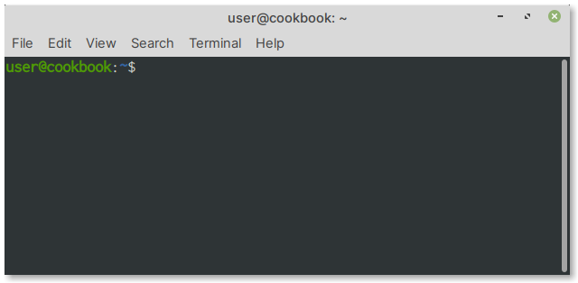

Shell and Terminal
==================
A :term:`shell` is a program that provides an interface
to the operating system's services.
The most commonly used shell in Linux distributions is
:term:`Bash`.

A *terminal* program runs the shell and provides an 
interface for users to type commands.

The default terminal application in Linux Mint is
:guilabel:`Terminal` (:numref:`fig-42a`).
You can launch it from the :guilabel:`Applications Menu` 
or by clicking on its icon in the Panel.

.. _fig-42a:

   A Terminal window

.. _pwd:

Once a terminal window is open, you can start typing 
commands at the ``$`` prompt.

For example, the following command:

.. code-block:: bash

   pwd

Will output the current working directory:

.. code-block:: console

   /home/user

The shell prompt
----------------
The prompt ``user@cookbook:~$`` in 
:numref:`fig-42a`, indicates the following:

``user``
   — username of the account
``cookbook``
   — the computer's hostname
``~``
   — short form for the user's home directory i.e.,
   ``/home/user``
``$``
   — a regular user account. For the root user, this
   will change to ``#``
