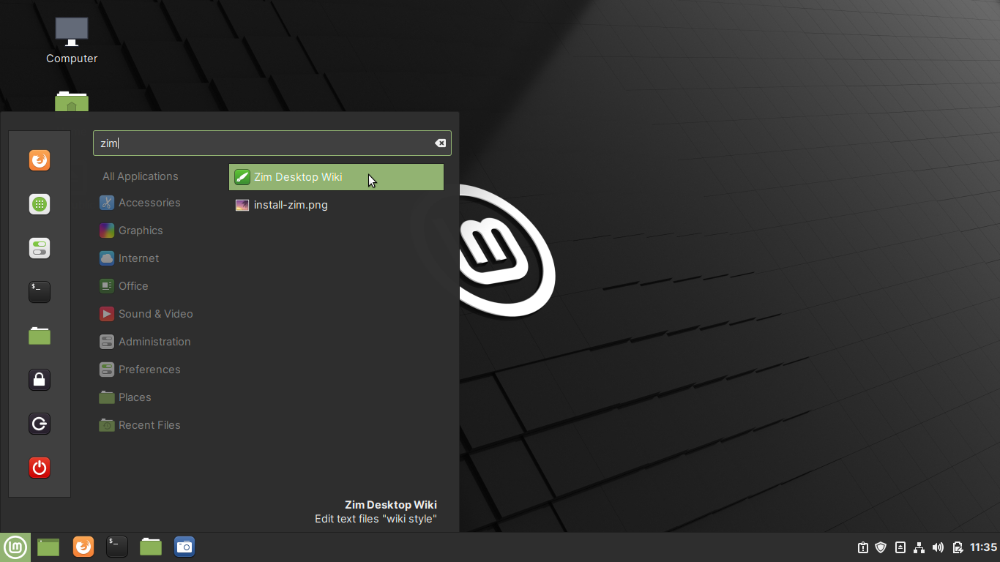
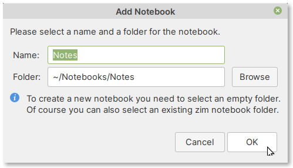

Creating a notebook
===================
Open Zim by clicking on its icon in applications 
menu (:numref:`fig-622b`). You can use the search bar to
locate it quickly.

.. _fig-622b:

   Opening Zim from applications menu
   
When you open the program for the first time, you will 
notice an :guilabel:`Add Notebook` dialog (:numref:`fig-622c`). 

Here, you can set a name for this notebook and select a 
directory to save notebooks.

.. _fig-622c:

   Add notebook

*You can accept the defaults*.

Click on the :guilabel:`OK` button to proceed. 

This will open the main window of the program 
(:numref:`fig-622d`).

.. _fig-622d:

.. figure:: images/zim-home.png

   Main window of Zim

