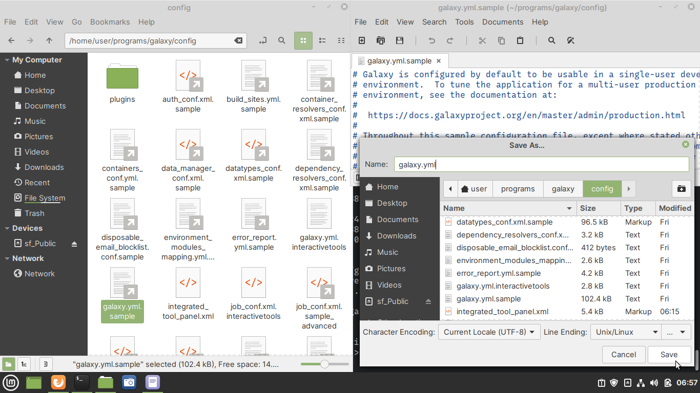

Creating a configuration file
=============================
A sample configuration file — ``galaxy.yml.sample``,
is included with Galaxy.

To create a configuration file using the sample file as 
template, follow the steps below (see :numref:`fig-731`):

1. Navigate to the
   ``$HOME/programs/galaxy/config`` directory using Files

2. *Double-click* on ``galaxy.yml.sample`` to open it in 
   Text Editor
   
3. Save it as ``galaxy.yml`` in the same directory

.. _fig-731:

   
   Copying sample configuration file of Galaxy

.. note::

   Alternatively, you can use the 
   :doc:`cp </command-line/commands/cp>` command in 
   a terminal to copy the file. 
   
   Assuming you are in the ``$HOME/programs/galaxy`` 
   directory, do:

   .. code-block:: bash
      
      cp config/galaxy.yml.sample config/galaxy.yml

