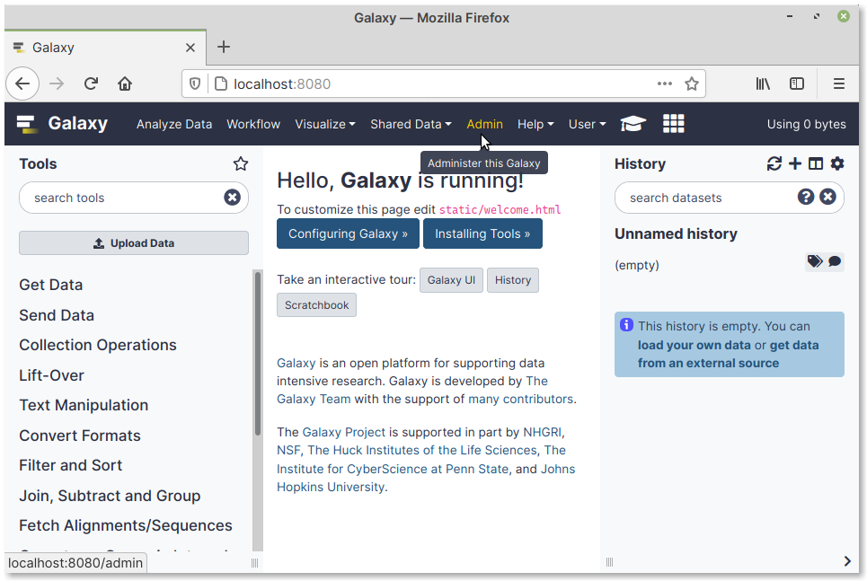
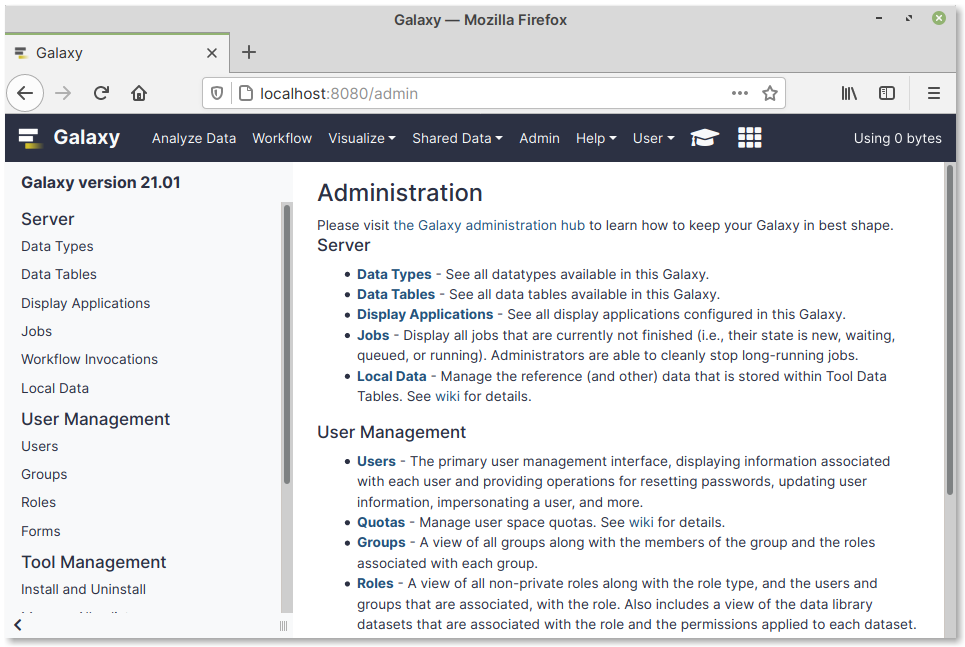
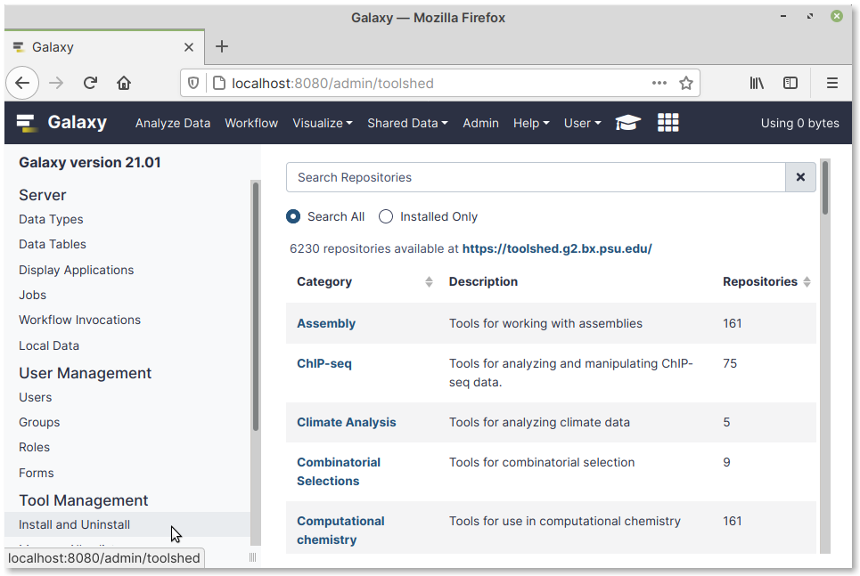

Verifying admin access
======================
When you log in again, you will see an :guilabel:`Admin` 
link in the navigation bar (:numref:`fig-734a`).

.. _fig-734a:

   Admin link in navigation bar
   
If you click on :guilabel:`Admin`, you will be taken to the 
administration page (:numref:`fig-734b`).

.. _fig-734b:

   Galaxy administration page
   
Installing tools
----------------
To install new tools, click on the following link:

:menuselection:`Tool Management --> Install and Uninstall` 

You will be taken to the tool management page 
(:numref:`fig-734c`). 

.. _fig-734c:

   Tool management page
   
From here, you can search and install tools from the 
Galaxy main tool shed.
