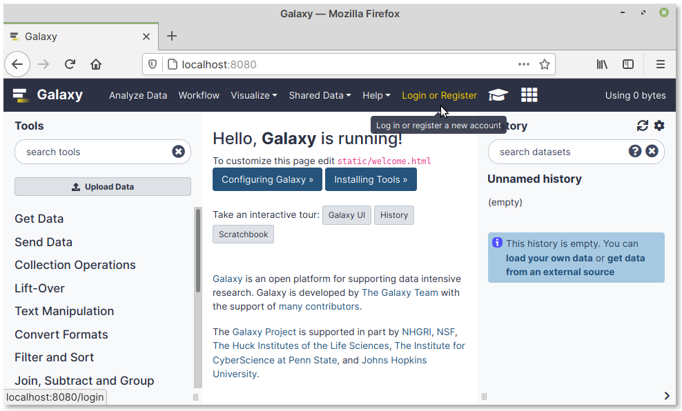
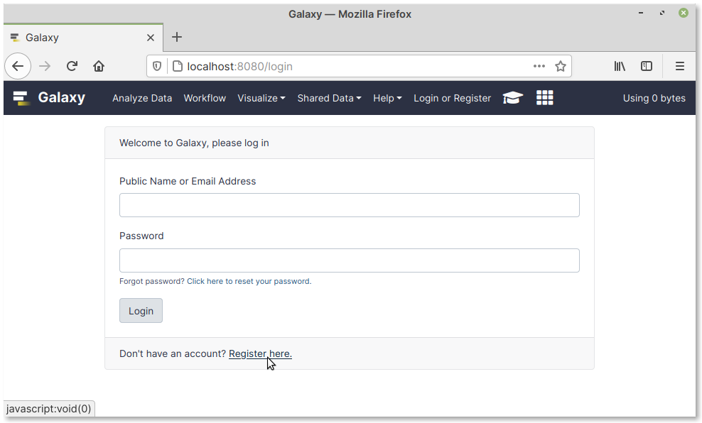
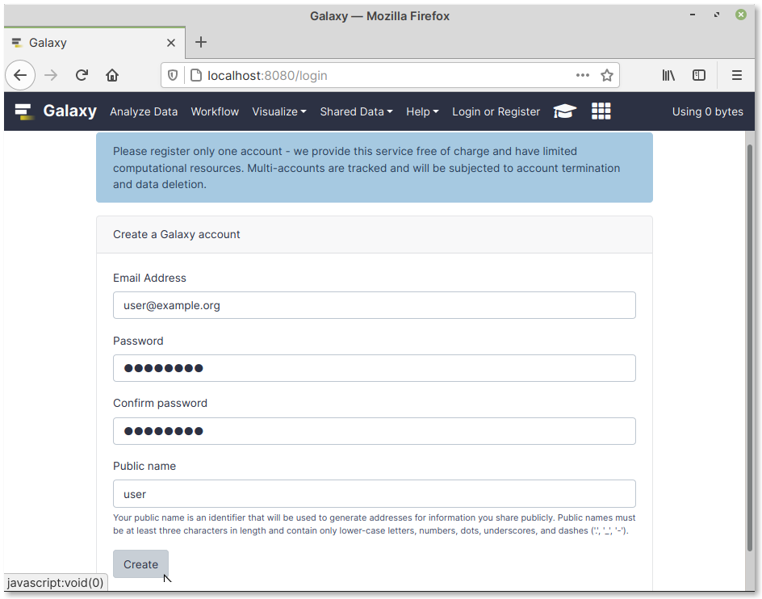

Registering a user account
==========================
On the Galaxy home page, click on the
:guilabel:`Login or Register` link in the navigation bar
(:numref:`fig-72a`).

.. _fig-72a:

   Click on the Login or Register link

You will be taken to the login page. 

Click on the :guilabel:`Register here` link at the bottom 
of the page (:numref:`fig-72b`).

.. _fig-72b:

   Click on the Register here link

On the :guilabel:`Create a Galaxy account` page, type in your
email address, a password and its confirmation, 
and a public name (:numref:`fig-72c`).

.. note::

   This user account is not related to your 
   accounts on usegalaxy.org or other Galaxy servers.
   
   It exists only in your local instance of Galaxy.
   You can also ignore the notice at the top of the
   page, which does not apply to local instances.

.. _fig-72c:

   User account creation page

Click on the :guilabel:`Create` button to proceed.

If account creation was successful, you will be
logged in and redirected to the home page of your
Galaxy instance.

.. toctree::
   :maxdepth: 1
   
   manage

