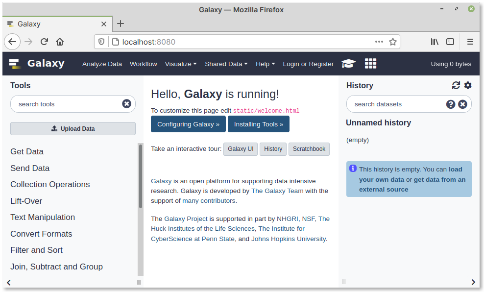

.. _start-galaxy:

Starting Galaxy
===============
While still in the ``galaxy`` directory, run the start-up 
shell script using the command:

.. code-block:: bash

   sh run.sh

.. note::

   When run for the first time, this script will take some
   time to complete.
   
   Subsequent runs will be faster.

Output:

.. code-block:: console

   Activating virtualenv at .venv
   Requirement already satisfied: pip>=8.1 in ./.venv/lib/python3.8/site-packages (20.0.2)
   ...

When you see messages like the following in the
terminal session, Galaxy is ready to use:

.. code-block:: console
   :emphasize-lines: 2

   Starting server in PID 11466.
   serving on http://localhost:8080

*Leave the terminal window open.*

Open a web browser window and type
http://localhost:8080 in the address bar.

You will see the home page of your local Galaxy
instance (:numref:`fig-714a`).

.. _fig-714a:

   Home page of your local Galaxy instance

You can start exploring the tools available or even
upload data and start using them. However, it is a good
idea to :doc:`register a user account <../register/index>`
now, so you do not lose data, when you clear 
browser history.

