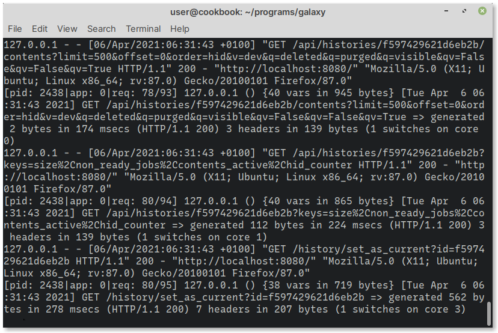
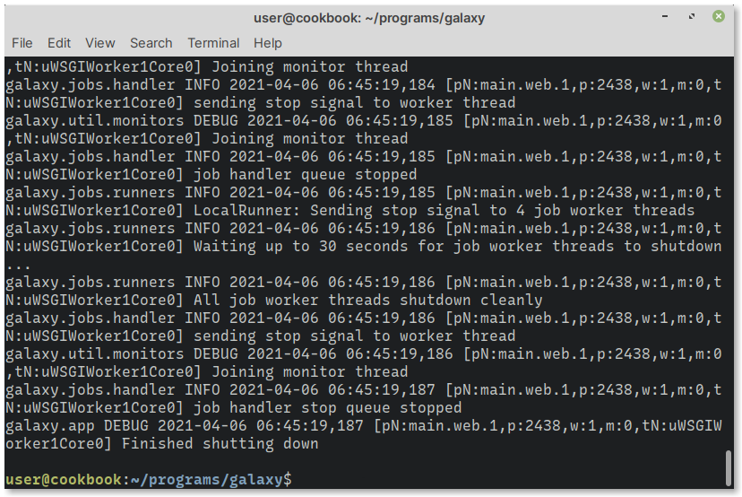

.. _stop-galaxy:

Stopping Galaxy
===============
To stop Galaxy, open the terminal window where you ran 
the ``sh run.sh`` command (:numref:`fig-714b`).

.. _fig-714b:

   Terminal window running Galaxy

Use the ``Ctrl + c`` keyboard shortcut to stop Galaxy i.e., 
press and hold ``Ctrl`` key and then press the
``c`` key.

When Galaxy has stopped running, you will see a message
:guilabel:`Finished shutting down` (:numref:`fig-714c`) in
the terminal.

.. _fig-714c:

   Galaxy has finished shutting down

You can now close the terminal window.

