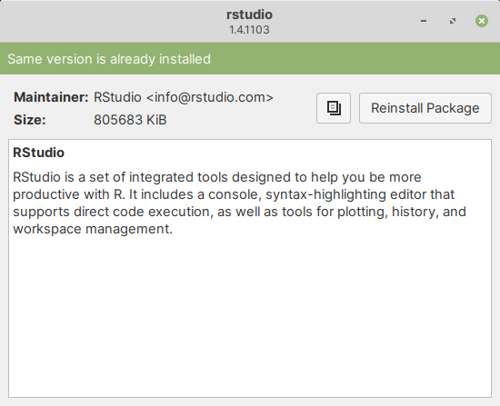

.. _installing-debian-package:

Installing a Debian package
===========================
To demonstrate the steps involved in installing a Debian
package, I will download and install
:term:`RStudio Desktop` — an IDE for R, distributed
as a Debian package.

1. Downloading Debian package
-----------------------------
Open the RStudio project's download_ page in a
web browser.

Under :guilabel:`Choose Your Version`, click on the download
button below :guilabel:`RStudio Desktop` (Open Source License)
(:numref:`fig-331a`).

.. _fig-331a:

.. figure:: images/1-rstudio-download-button.png
   
   Download RStudio Desktop (Open Source License)

This will take you to the installers section with
information on the current version (:numref:`fig-331b`).

.. _fig-331b:

   
   RStudio Desktop installers

.. note::

   Although the instructions in :numref:`fig-331b` state 
   that you will need to install R before installing 
   RStudio, you can safely *skip that step*.
   
   The Gdebi program used here, will automatically 
   install R, while installing RStudio.

Scroll down to the :guilabel:`All Installers` section.

Click on the download link corresponding to
:guilabel:`Ubuntu 18/Debian 10` (:numref:`fig-331c`).

.. _fig-331c:

.. figure:: images/3-rstudio-installers.png
   
   RStudio installers for different operating systems

In the dialog window that appears, select 
:guilabel:`Save File` and then click on the 
:guilabel:`OK` button (:numref:`fig-331d`).

.. _fig-331d:

.. figure:: images/4-rstudio-save-file.png
   
   Save installer file

Once the file download is complete, you can find it in
your :guilabel:`Downloads` directory.

2. Installing downloaded package
--------------------------------
Open file manager and navigate to your Downloads
directory.

*Double-click* on the downloaded file (:numref:`fig-331e`).

.. _fig-331e:

   Downloaded Debian package

This will open the Gdebi application.
Click on the :guilabel:`Install Package` button 
(:numref:`fig-331f`).

.. _fig-331f:

.. figure:: images/6-rstudio-install-package.png
   
   Gdebi: Click on the Install Package button

You will be prompted to enter *your password*. Type in 
your password and click on the :guilabel:`Authenticate` 
button to proceed (:numref:`fig-331g`).

.. _fig-331g:

   
   Enter your password when prompted

As this package has additional dependencies, another
dialog will appear listing these packages, which need to
be installed in order for it to work.

Click on the :guilabel:`Continue` button to proceed 
(:numref:`fig-331h`).

.. _fig-331h:

   Additional dependencies to be installed

Installation will now proceed (:numref:`fig-331i`).

.. _fig-331i:

.. figure:: images/9-rstudio-install-progress.png

   Installation progress

When installation is complete, you will see a message
:guilabel:`Same version is already installed`, at the top 
of the window (:numref:`fig-331j`).

.. _fig-331j:

   
   Package installed successfully

3. Launching installed programs
-------------------------------
You can launch installed programs from the
:guilabel:`Applications Menu` (:numref:`fig-331k`).

.. note::

   This only applies to applications with a graphical
   user interface.

.. _fig-331k:

.. figure:: images/11-launch-rstudio.png

   Launching installed program from applications menu

The main window of the program will be displayed
(:numref:`fig-331l`).

.. _fig-331l:

.. figure:: images/12-rstudio-main-window.png
   
   Main window of RStudio Desktop

.. _download: https://rstudio.com/products/rstudio/download/
