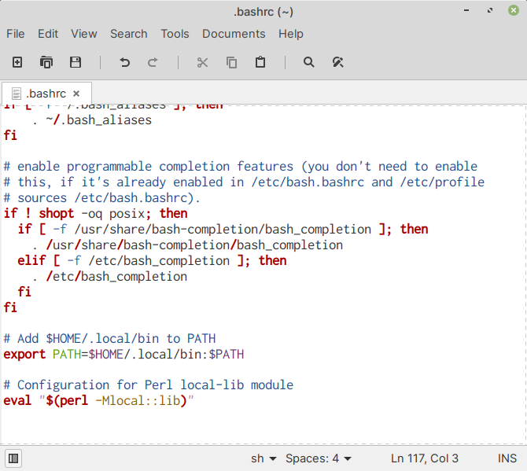
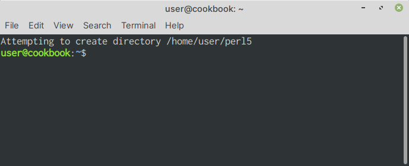

.. index:: bashrc
.. _configure-local-lib:

Configuring local-lib module
============================
To configure local-lib:

Open the ``$HOME/.bashrc`` file in a :term:`text editor`.

Add the following text at the end of the file:

.. code-block:: bash

   # Configuration for Perl local-lib module
   eval "$(perl -Mlocal::lib)"
   
Save the file. 

Here is a sample ``.bashrc``, for reference 
(:numref:`fig-322a`).

.. _fig-322a:

   local-lib configuration in .bashrc
      
Open a new terminal window. 

You will notice the following message displayed 
(:numref:`fig-322b`):

.. _fig-322b:

   
   Attempting to create directory /home/user/perl5
   
*Configuration is now complete*. 

You can now start installing modules from CPAN and other 
sources.

