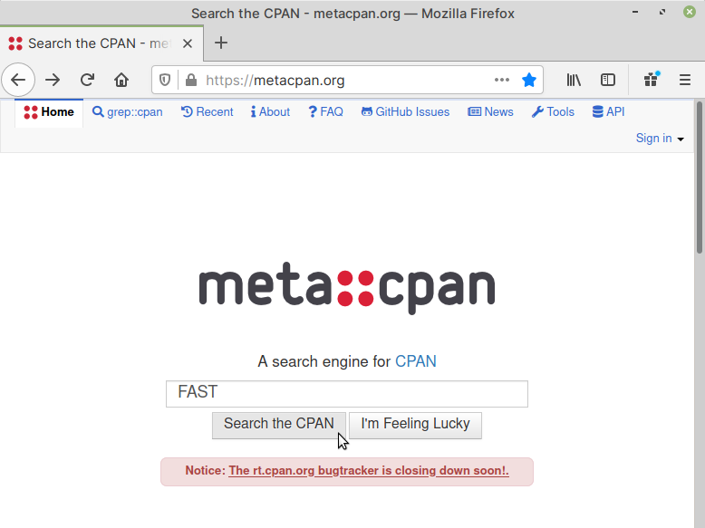
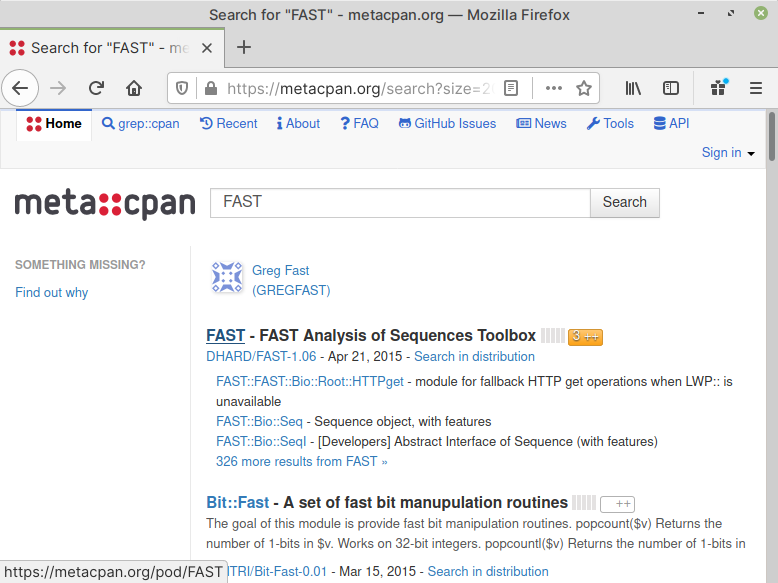
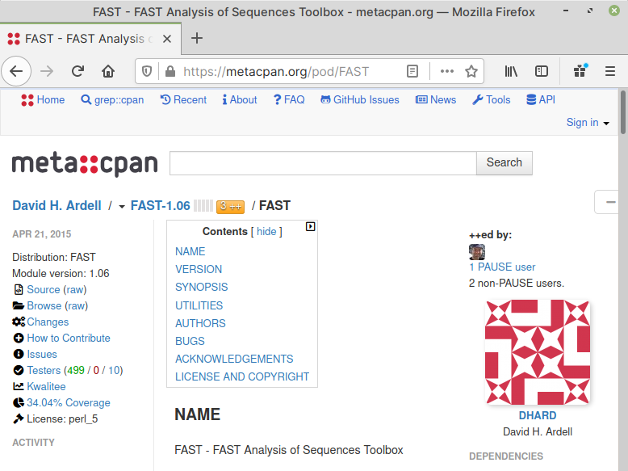
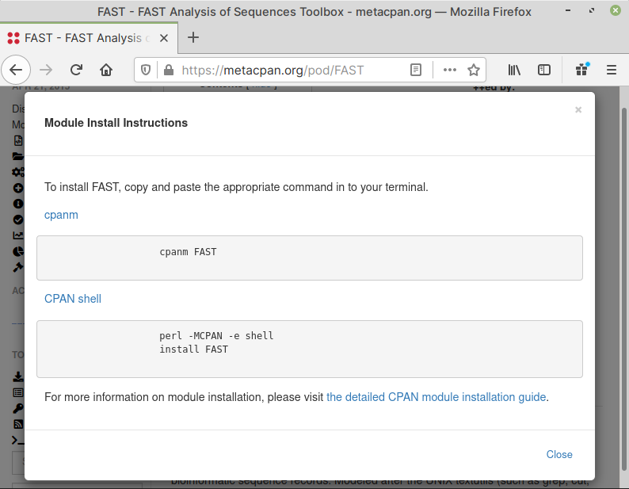

Searching for a module on CPAN
==============================
Open :term:`MetaCPAN` website (https://metacpan.org) in 
a web browser. 
      
In the :guilabel:`Search field`, enter the name of the 
module you would like to install and click on the 
:guilabel:`Search the CPAN` button.

I will use David H. Ardell's :term:`FAST` package as
an example. (:numref:`fig-322c`).

.. _fig-322c:

   Searching for a module on MetaCPAN
   
This should display modules matching the search term —
``FAST`` (:numref:`fig-322d`).

.. _fig-322d:

   Search results for modules

If you click on the *appropriate* module name, you will be
taken to a description page, where you can learn more about 
the module (:numref:`fig-322e`).
   
.. _fig-322e:

  
   Module description page

On this page, you can also verify the module name to use in
the next step. 

To do that, click on :guilabel:`Install Instructions`
under :guilabel:`TOOLS` menu in the sidebar. This will 
open a pop-up window with information on the module 
name you need to use with the ``cpanm`` command. 

In this case, the module name to use, is simply 
called ``FAST`` (:numref:`fig-322f`).

.. _fig-322f:

   Module install instructions for FAST

You can now proceed towards installing this module.

