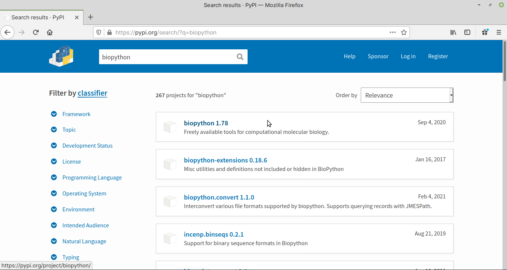
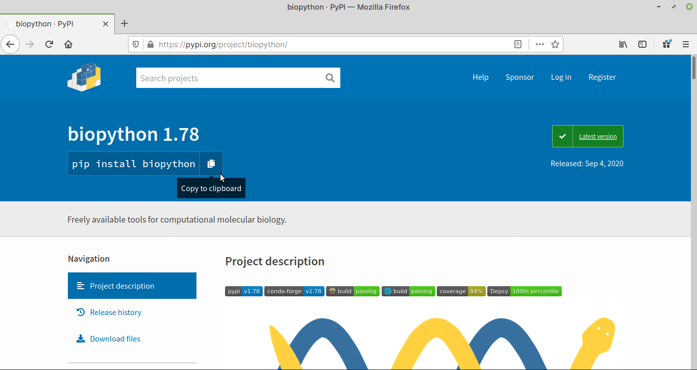

Searching for a package on PyPI
===============================

Open `PyPI website <https://pypi.org>`_ in a web browser.
   
In the :guilabel:`Search projects` field, enter the name of the
software you would like to install and press the 
:guilabel:`ENTER` key or click on the search 
button (:numref:`fig-321a`).

.. _fig-321a:

.. figure:: images/pypi-search.png

   Searching for a package on PyPI
      
A list of packages matching the search term will be 
displayed (:numref:`fig-321b`).

.. _fig-321b:

   Search results for biopython. 1.78 is the version number.
   
Click on the result to proceed to the project description
page.
      
In the project description page, find 
the package name (:numref:`fig-321c`) in the 
``pip install`` command. 

In this case, it is ``biopython``.

.. _fig-321c:

   
   Project description page for Biopython
   
.. note::

   You will need to use ``pip3`` instead of
   the ``pip`` command in the steps below. 
   :ref:`Why? <why-pip3>`
   
You can now proceed towards installing the package.

