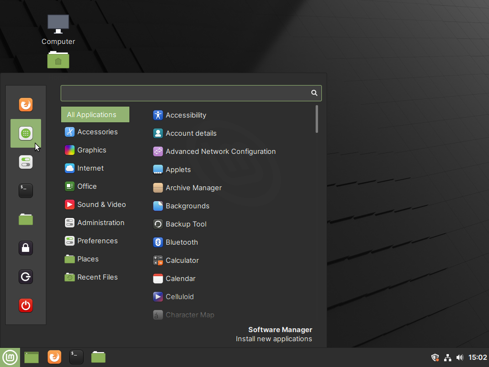
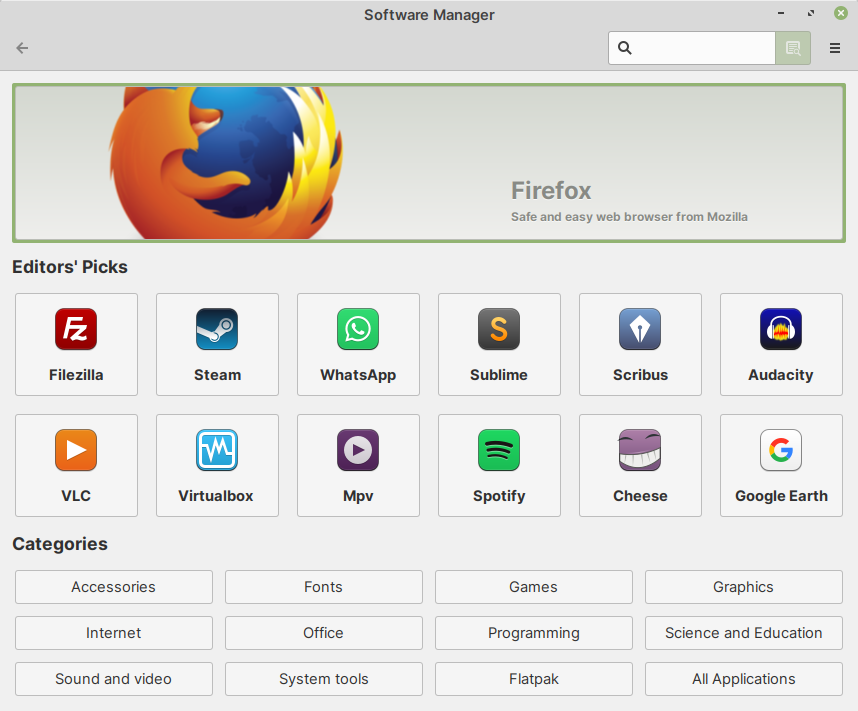
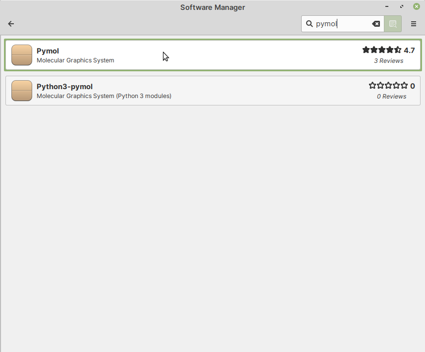
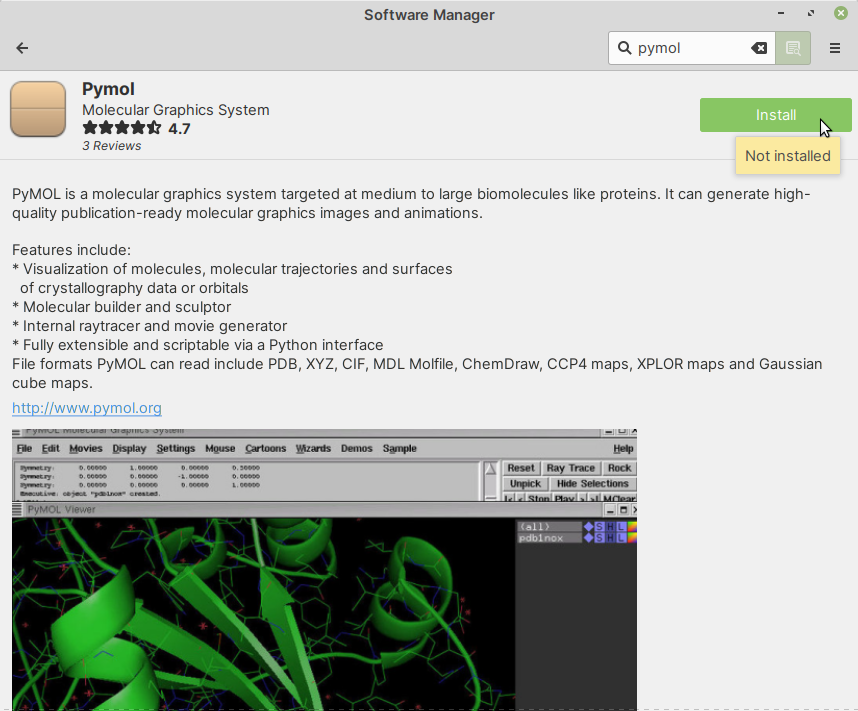
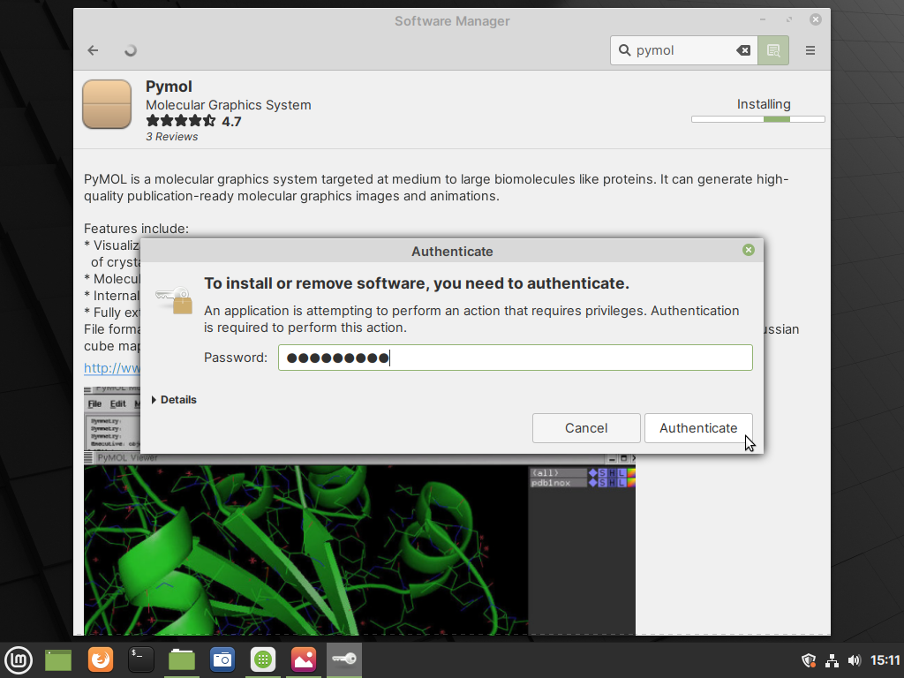
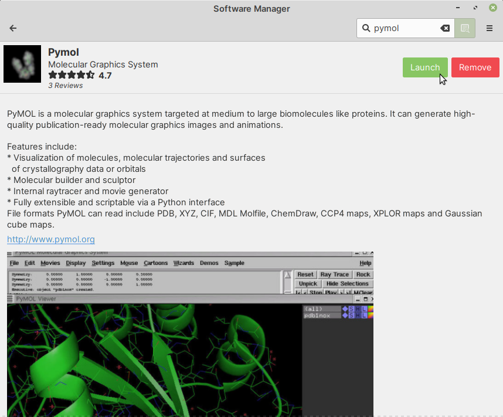
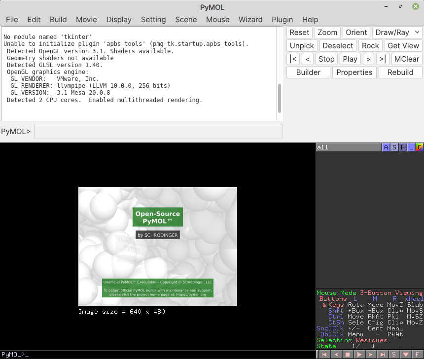

Finding and installing software
===============================
To demonstrate the steps involved, I will install
:term:`PyMOL` — a software for molecular visualization. You 
can follow the same procedure for finding and installing 
other software available in the repositories.

Open :guilabel:`Software Manager` by clicking on
its icon in the applications' menu (:numref:`fig-312a`). 

You can also launch it from the :guilabel:`Administration`
section of the applications' menu.

.. _fig-312a:

   
   Click on Software Manager in applications' menu

When launched, you will see its main window 
(:numref:`fig-312b`).

.. _fig-312b:

   
   Main window of Software Manager

In the search bar, type ``pymol``.

In some time, packages in repositories that match the
search term i.e., pymol, will be displayed below 
(:numref:`fig-312c`).

.. _fig-312c:

   
   Search results for pymol
   
Click on the first result — :guilabel:`Pymol`. You will 
be taken to the package description page.

.. note::

   Why not select :guilabel:`Python3-pymol`?

   The description of the second result, 
   :guilabel:`Python3-pymol` indicates that it contains 
   Python 3 *modules* for working with PyMOL, which is 
   not what we are looking for.

   If you are unsure, you can read the complete 
   description of the package on the next page and 
   confirm if this is the package you would like to 
   install.

In the package description page, click on the
:guilabel:`Install` button (:numref:`fig-312d`).

.. _fig-312d:

   
   Click on the Install button to install this package

An dialog window will now appear, prompting you to 
enter *your password*.

Type in your password and click on the 
:guilabel:`Authenticate` button (:numref:`fig-312e`).

.. _fig-312e:

   
   Type in your password and click on the Authenticate 
   button
   
Installation will now proceed.

When installation is complete, you will 
notice two buttons — :guilabel:`Launch` and 
:guilabel:`Remove`, in place of the :guilabel:`Install` 
button (:numref:`fig-312f`).

.. _fig-312f:

 
   Installation complete. Notice the Launch and Remove 
   buttons

Click on the :guilabel:`Launch` button. This will
open the PyMOL program (:numref:`fig-312g`).

.. _fig-312g:

   
   Main window of PyMOL
   
Alternatively, you can search for the application in the 
:guilabel:`Applications Menu` and launch it from there.

.. note::
   
   For applications that do not have a graphical 
   user interface, the :guilabel:`Launch` button will 
   not be present.
   
   If the program includes any commands, you can access 
   them in a :doc:`terminal </using-linux/applications/terminal>`
   session.

