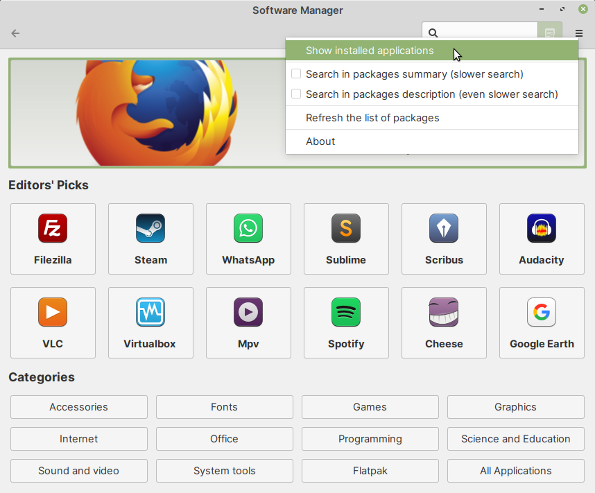
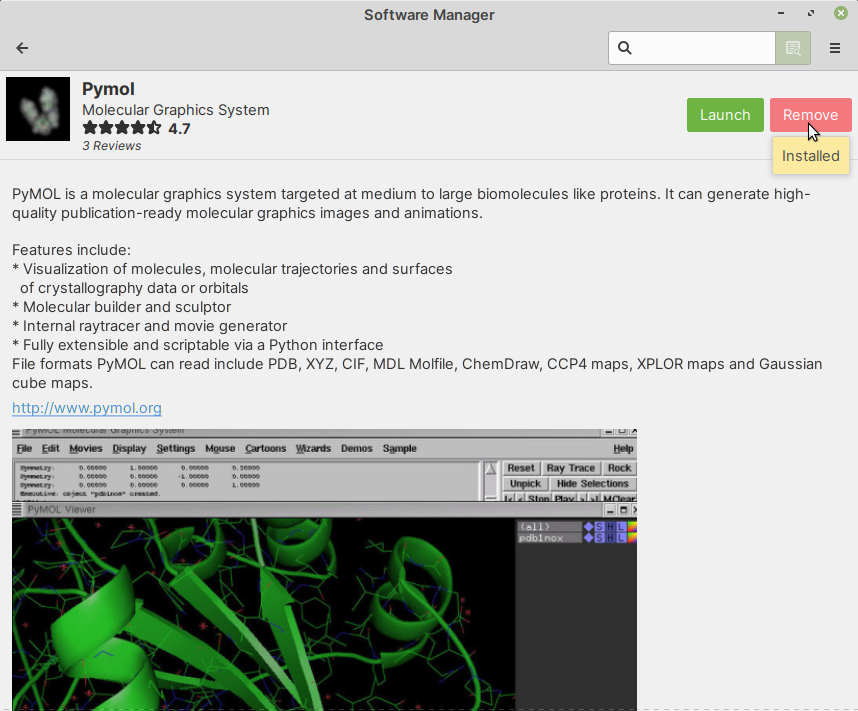
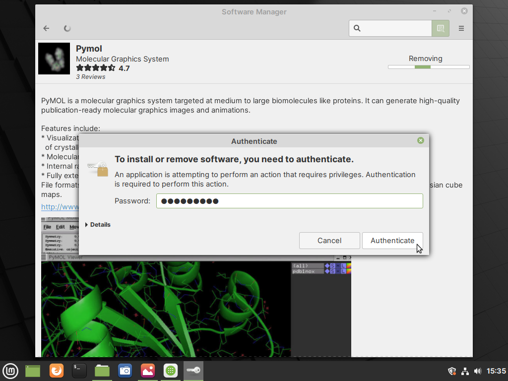

.. _removing-installed-software:

Removing installed software
===========================
You can follow these steps to remove software installed
from repositories. 

Open :guilabel:`Software Manager`.

Click on the settings button in the main application
window and then select 
:guilabel:`Show installed applications`
(:numref:`fig-313a`).

.. _fig-313a:

   
   From Software Manager settings, select 
   Show Installed Applications
   
Alternatively, you can type the name of the software
in the search bar and then press the 
:guilabel:`ENTER` key.
   
In the list of :guilabel:`Installed Applications`, 
click on the package you would like to remove — Pymol, 
in this case (:numref:`fig-313b`). 
   
.. _fig-313b:

.. figure:: images/9-select-pymol-for-removal.png      
 
   Click on the package you would like to remove

You will be taken to the package description page.
   
Click on the :guilabel:`Remove` button to remove 
(or uninstall) the package (:numref:`fig-313c`).

.. _fig-313c:

   
   Click on the Remove button to remove the package

You will be prompted to enter your password.

Type in *your password* and then click on the
:guilabel:`Authenticate` button to proceed 
(:numref:`fig-313d`).

.. _fig-313d:

  
   Type in your password and click on the Authenticate 
   button
      
The software will now be removed (or uninstalled) from
the system.
