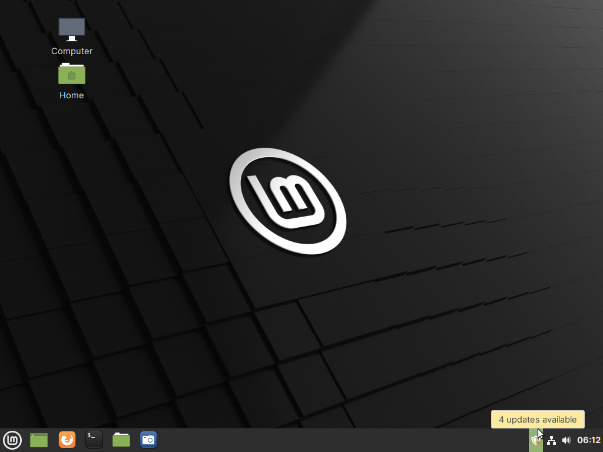
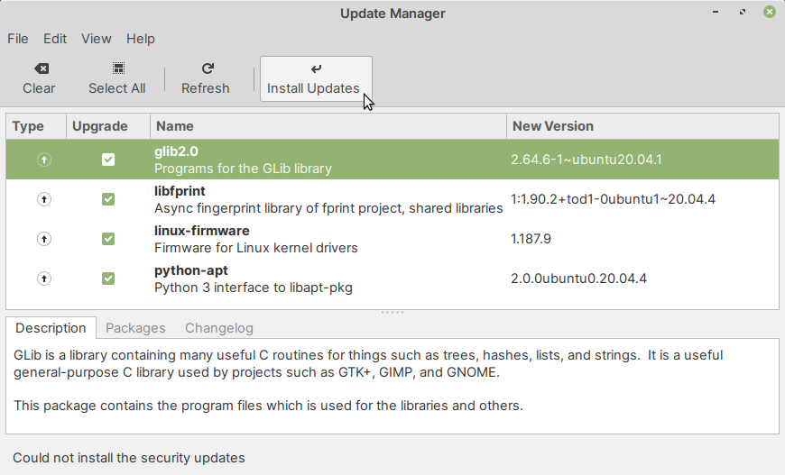
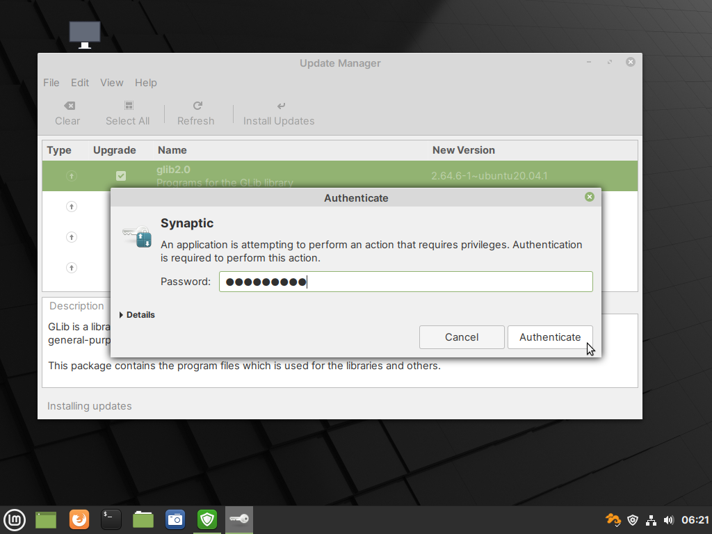
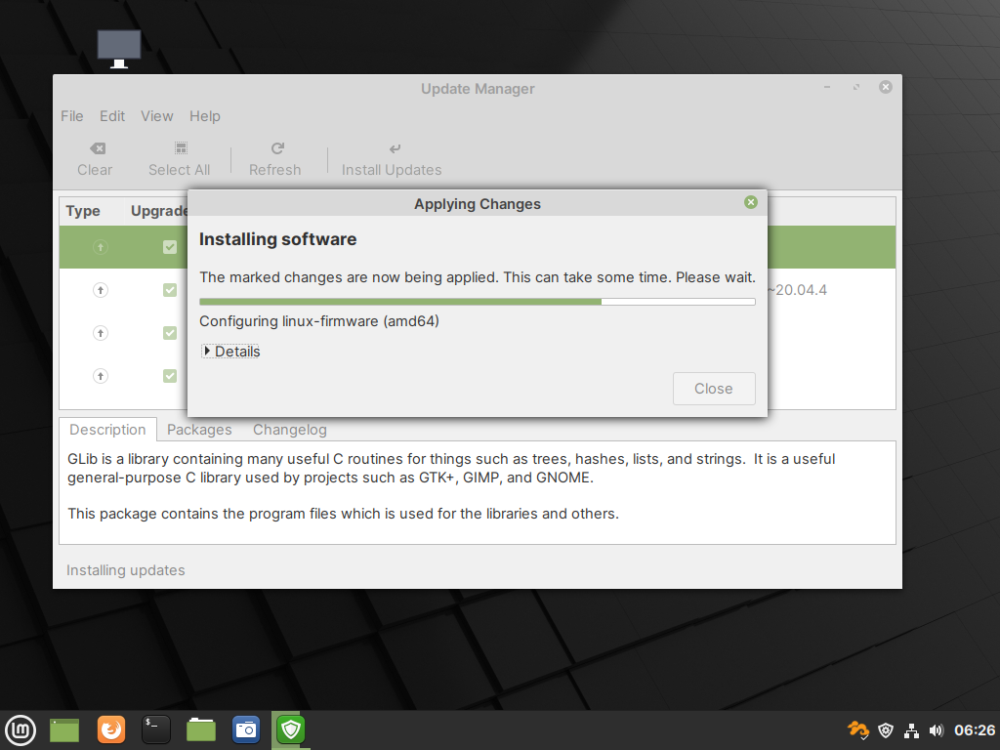
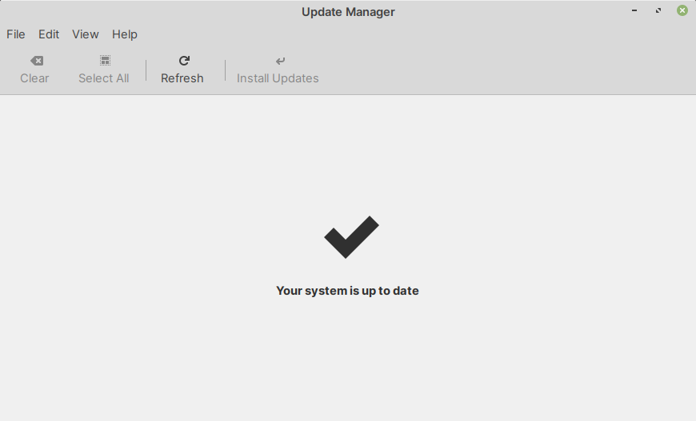

Updating installed software
===========================
When updates are available for software installed on
your system, you will see a notification in the 
system tray (:numref:`fig-314a`).

.. _fig-314a:

  
   Notification of software updates in system tray
   
To apply software updates:

Click on the notification icon in system tray.
This will open the :guilabel:`Update Manager` program.

To install all available software updates, click
on the :guilabel:`Install Updates` button in the toolbar
(:numref:`fig-314b`).

.. _fig-314b:

   Click on the Install Updates button to
   apply all available updates

You will be prompted to enter your password 
(:numref:`fig-314c`).

Type in *your password* and click on the
:guilabel:`Authenticate` button.

.. _fig-314c:

   
   Type in your password and click on the Authenticate 
   button
   
:guilabel:`Update Manager` will now continue 
installing updates (:numref:`fig-314d`).

.. _fig-314d:

  
   Update Manager installing software updates
   
When the update process is complete, you will see
a message — :guilabel:`Your system is up to date`
(:numref:`fig-314e`).

.. _fig-314e:

   
   Updates installed successfully

