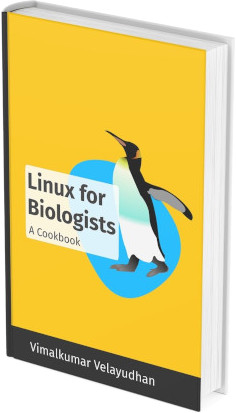

.. Linux for Biologists master file, created by
   sphinx-quickstart on Tue Nov 24 20:43:08 2020.
   You can adapt this file completely to your liking, but it should at least
   contain the root `toctree` directive.

Linux for Biologists
====================
A guide for students and researchers.

Learn how to run and use a Linux desktop, use the
included software, run some basic commands,
and work with files and directories.

The e-book
----------

This book is free to read under the `creative commons`_
license.

You can support my work by purchasing the e-book version
(PDF and EPUB) from Leanpub_.

With your purchase, you will get direct **email support**
and **updated versions**, when released.

Sample chapters
...............

In PDF_ and EPUB_ formats.

Screenshots
...........
Some pages from the PDF format e-book. Click to view a
larger version.

.. image:: _static/sample.png
   :alt: pages from Linux for Biologists e-book
   :target: _static/sample.png

---

If you need help
----------------
If you need help while following this book, you can post
your query in the `community forum`_.

.. note::

   If your query is related to the usage of a software
   discussed in the book, please contact the website or
   the author of the software itself.

Live support
............
If you need help faster, you can book a 1 hour
`live support session`_.

During the session, I will help you with your query or
provide a walk-through of concepts
discussed in the book. Once you make a booking, I will be
in touch to arrange a suitable date and time for the
online meeting.

---

Table of Contents
-----------------

.. toctree::
   :maxdepth: 3
   :numbered: 3

   about/index
   using-linux/index
   getting-software/index
   command-line/index
   galaxy/index
   zotero/index
   zim/index
   glossary
   credits

:ref:`genindex`

---

Last updated: |today|

.. links

.. _creative commons: http://creativecommons.org/licenses/by-nc-sa/4.0/
.. _Leanpub: https://leanpub.com/linuxforbiologists/
.. _PDF: _static/sample.pdf
.. _EPUB: _static/sample.epub
.. _community forum: https://community.leanpub.com/c/linuxforbiologi
.. _live support session: https://gumroad.com/l/riVNV

