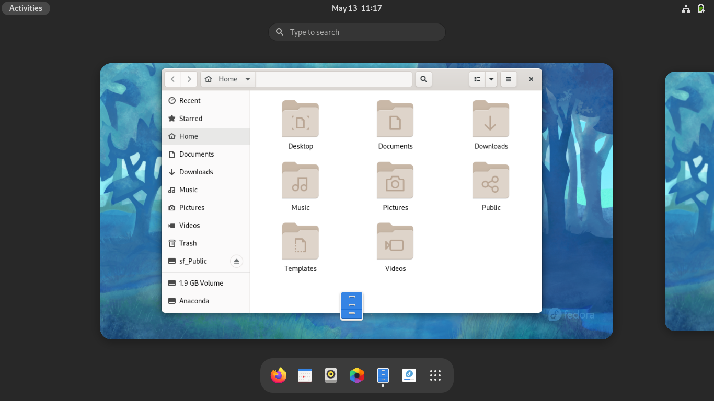
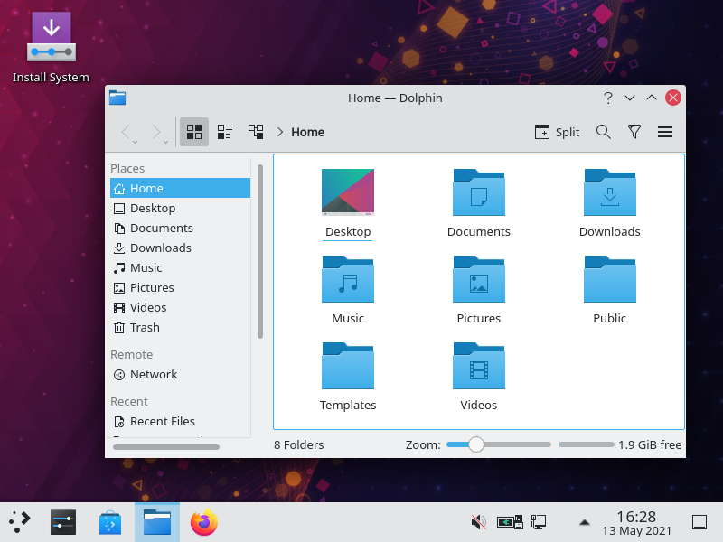
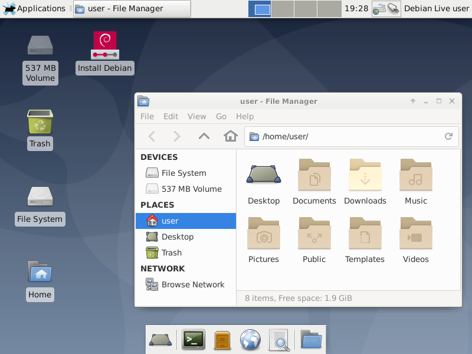
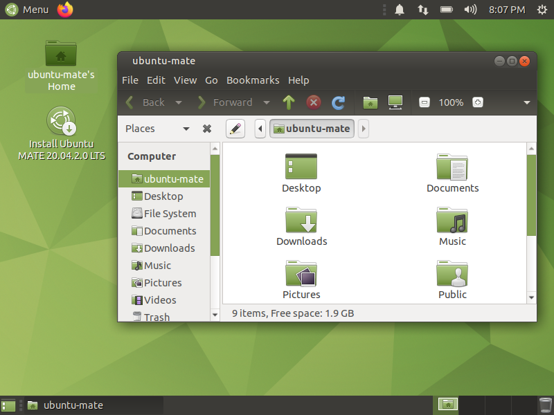

Desktop environment
===================
A desktop environment is a 
:term:`graphical user interface <GUI>`
that provides easy access to files and applications. 

Examples: 

- GNOME (:numref:`fig-212a`)
- KDE Plasma (:numref:`fig-212b`)
- Xfce (:numref:`fig-212c`)
- MATE (:numref:`fig-212d`)
- Cinnamon (:numref:`fig-212e`) 

Linux distributions might offer additional variants 
for download, depending on the desktop environment in use.

.. _fig-212a:

   GNOME

.. _fig-212b:

   KDE Plasma

.. _fig-212c:

   Xfce

.. _fig-212d:

   MATE

