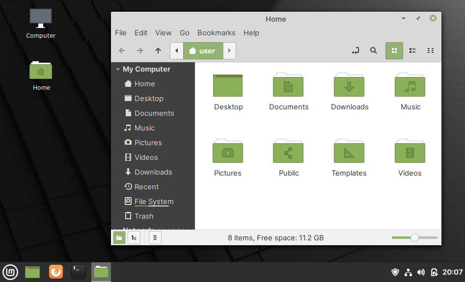

This book uses Linux Mint
=========================
This book uses :term:`Linux Mint` (Cinnamon edition) as
the reference Linux distribution (:numref:`fig-212e`).

.. _fig-212e:

   Linux Mint with Cinnamon desktop environment

The software installation and configuration steps
discussed in the book have been tested on this
distribution (version 20.1).

In the next section, I will show you how to run Linux Mint
on your computer or in the cloud.

What about other Linux distributions?
-------------------------------------

Ubuntu and derivatives
......................
The instructions in this guide will work on
:term:`Ubuntu` 20.04 LTS and distributions based on it,
with some *minor* changes. You might need to install
additional packages or use different software.

For example, instead of :term:`Files` (file manager) used
in this book, you will use Nautilus or Dolphin.

Other distributions
...................
Reproducing these steps on other Linux distributions might
involve some *additional* effort.

If there are problems, I recommend you use Linux Mint for
following the steps in this book.

