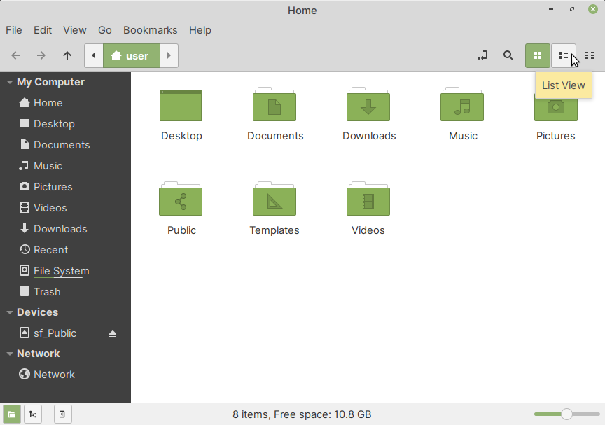

.. index:: Files

Files — manage files and directories
====================================
Files is the default file manager (:numref:`fig-241a`) in
Linux Mint. 

.. _fig-241a:

   Main window of Files
   
Using Files
-----------
You can launch Files from the 
:guilabel:`Applications Menu` or by clicking on its 
icon in the :guilabel:`Panel`.

These are some tips on using Files.

Toggle icon and list views
..........................
You can quickly switch between Icon and List View
using icons in the toolbar.

Toggle sidebar
..............
You can open the sidebar view or hide it using icons in 
the status bar.

Open an extra pane
..................
You can open an extra pane using:

:menuselection:`View --> Extra Pane`

This is especially useful when you are copying files between
local directories or when connected to remote systems.

Bookmark locations
..................
When you are browsing a directory, you can bookmark it 
if you will access it frequently. This function is 
available under:

:menuselection:`Bookmark --> Add Bookmark`

Connect to servers
..................
Files can be used to connect to
external servers using FTP, SSH, Samba and Webdav.
This option is available under:

:menuselection:`File --> Connect to Server`

To learn more about this feature, read the following 
section in this book: 
:doc:`/using-linux/files/transfer-files`.

