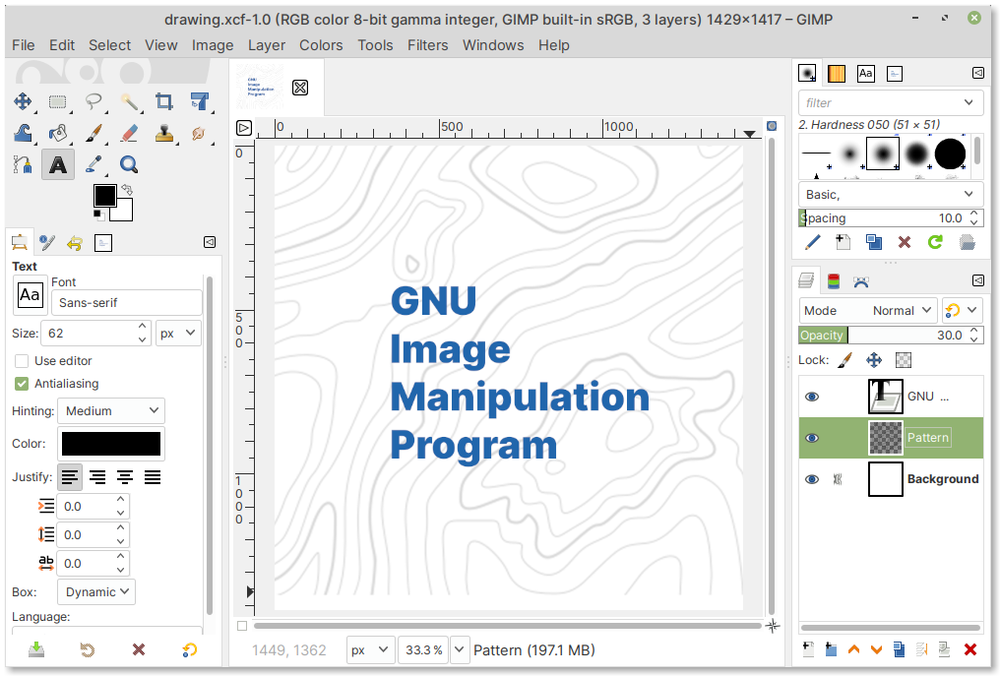

GNU Image Manipulation Program — edit images
============================================
The GIMP program can be used to edit images in
various formats like JPG, PNG, TIFF, BMP etc.,
(:numref:`fig-248a`).

.. _fig-248a:

   Editing an image in GIMP

