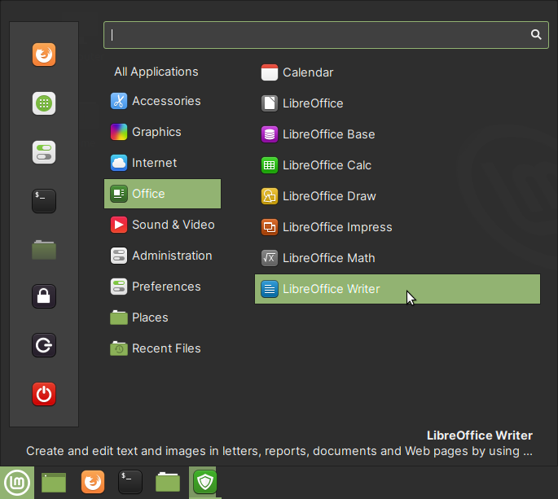

Available software
==================
This is a brief overview of applications included in 
Linux Mint 20.1 Cinnamon.

You can launch them from the :guilabel:`Applications Menu`
(:numref:`fig-24a`). You can search the list of
installed applications using the search bar.

.. _fig-24a:

   Launching an application

.. note::

   Some applications discussed here are not included in the 
   default installation.

   This includes
   :doc:`GNU Image Manipulation Program <gimp>` and
   :doc:`Inkscape <inkscape>`. You can install 
   them using :term:`Software Manager`.

.. toctree::
   :maxdepth: 1

   files
   firefox
   text-editor
   libreoffice
   terminal
   screenshot
   software-manager
   gimp
   inkscape
   notes

