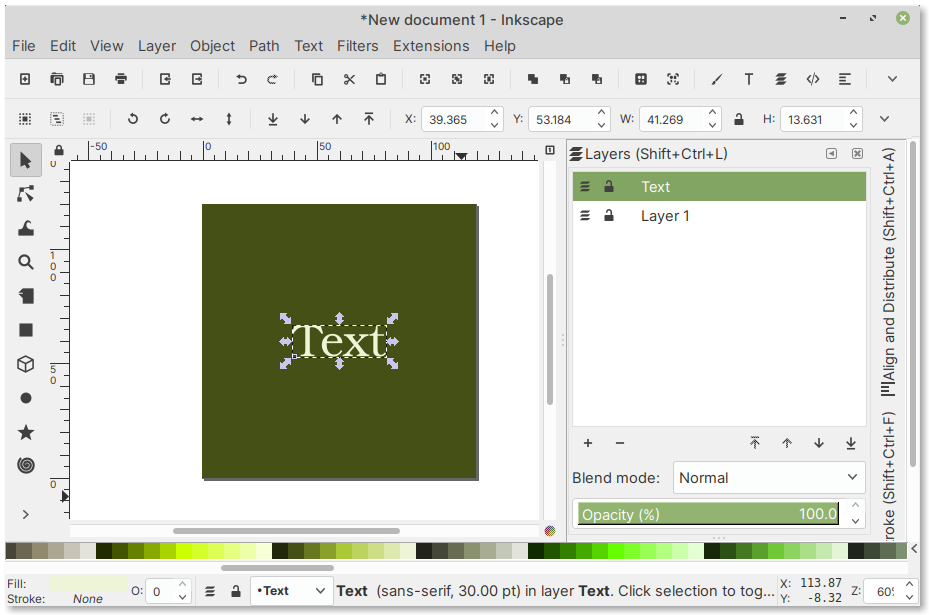

Inkscape — create vector graphics
=================================
Inkscape can be used to create and edit images in
the scalable vector graphics (SVG) format
(:numref:`fig-249a`).

.. _fig-249a:

   Creating vector graphics in Inkscape
