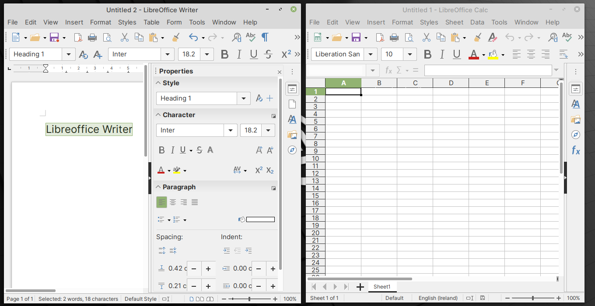

LibreOffice — edit documents and spreadsheets
=============================================
LibreOffice Writer and LibreOffice Calc can be used to 
create and edit documents and spreadsheets, respectively
(:numref:`fig-244a`).

.. _fig-244a:

   LibreOffice Writer and Calc programs

The default file formats used by Writer and Calc are
:guilabel:`ODF Text Document (.odt)` and
:guilabel:`ODF Spreadsheet (.ods)` respectively.

These applications also support reading and writing files 
in Microsoft Office formats like ``.docx`` or ``.doc`` (Word)
and ``.xlsx`` or ``.xls`` (Excel).

There are additional applications in
the LibreOffice suite with functionality to create and
edit slide shows or presentations, scientific formulas,
diagrams and file-based databases.

