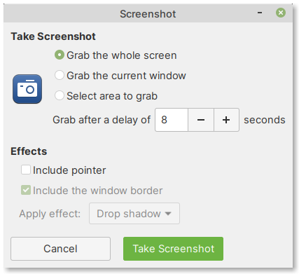

Screenshot — take screenshots of desktop or windows
===================================================
The Screenshot program is useful for taking screenshots
of the entire screen, an application window or a selected
area of the screen (:numref:`fig-246a`).

.. _fig-246a:

   Screenshot program

