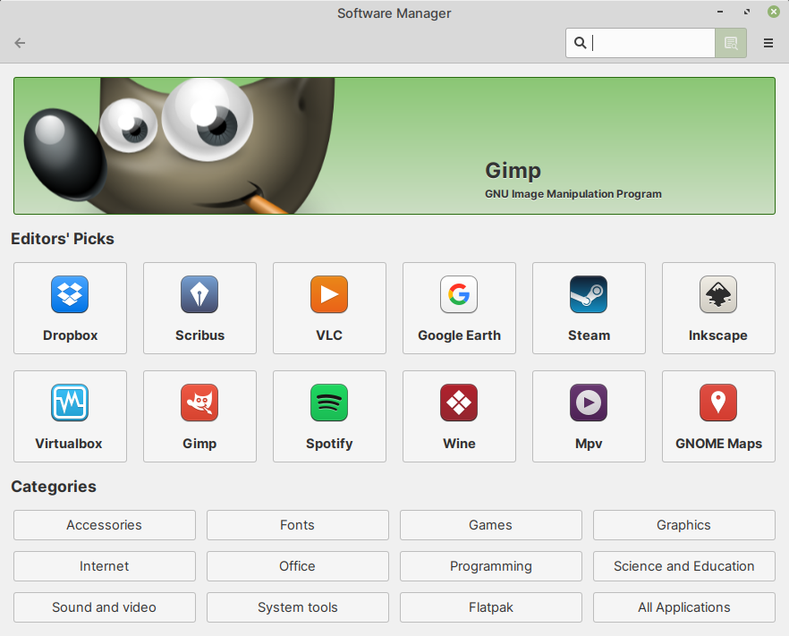

.. index:: Software Manager

Software Manager — install software from repositories
=====================================================
Software Manager can be used to install
software from Linux Mint, Ubuntu, Debian and Flathub
repositories (:numref:`fig-247a`).

For a step-by-step procedure for installing software using
Software Manager, please consult
:doc:`/getting-software/quick-and-easy/index`.

.. _fig-247a:

   Software Manager
