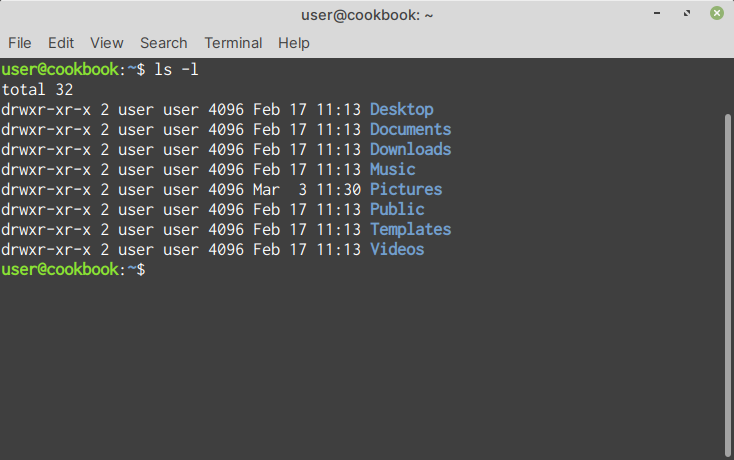
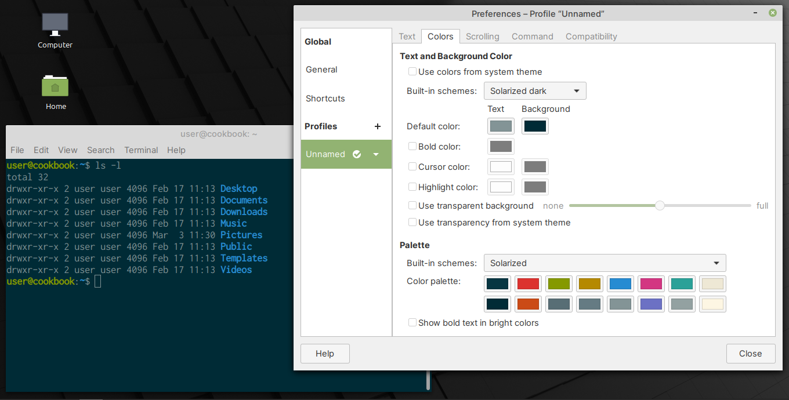

Terminal — access the command-line
==================================
The Terminal application (:numref:`fig-245a`) provides the
possibility of working with the command-line interface.
The default login shell for users on Linux Mint is :term:`Bash`.

.. _fig-245a:

   Terminal

By selecting the :menuselection:`Edit --> Preferences` menu
item, you can customize Terminal's appearance and 
functionality (:numref:`fig-245b`).

.. _fig-245b:

   Changing Terminal colour scheme in preferences
