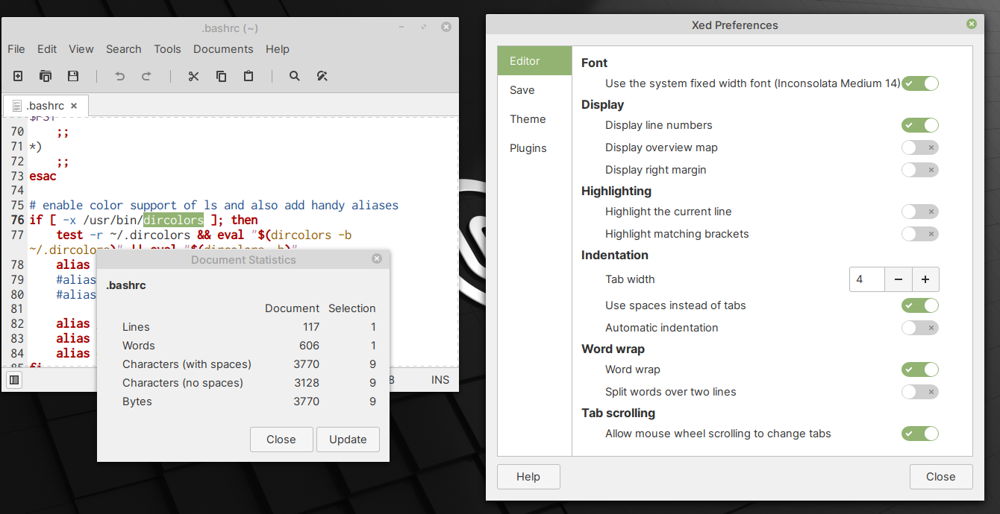

Text Editor — create and edit text files
========================================
The Text Editor can be used for working with files in
plain text formats like ``.txt``, ``.md`` and ``.fasta``,
or editing configuration files like ``.bashrc``
(:numref:`fig-243a`).

.. _fig-243a:

   Text Editor with Document Statistics and
   Preferences windows open

Using
:menuselection:`Edit --> Preferences`, you can customize
settings like the font used, display of line numbers,
indentation, word wrap etc.,

The :menuselection:`Tools --> Document Statistics`
feature is useful for counting the numbers of words and
characters in a document.

.. index:: bashrc

Opening hidden files in Text Editor
-----------------------------------
To open hidden files in Text Editor:

1. Use :menuselection:`File --> Open` to select a file
2. In the :guilabel:`Open Files` dialog that appears,
   right-click in the middle pane and select
   :guilabel:`Show Hidden Files` (:numref:`fig-243b`).

   .. _fig-243b:

   .. figure:: images/text-editor-hidden-files.png

      Opening hidden files in Text Editor
   
   You can also use the ``Ctrl + h`` keyboard shortcut.
