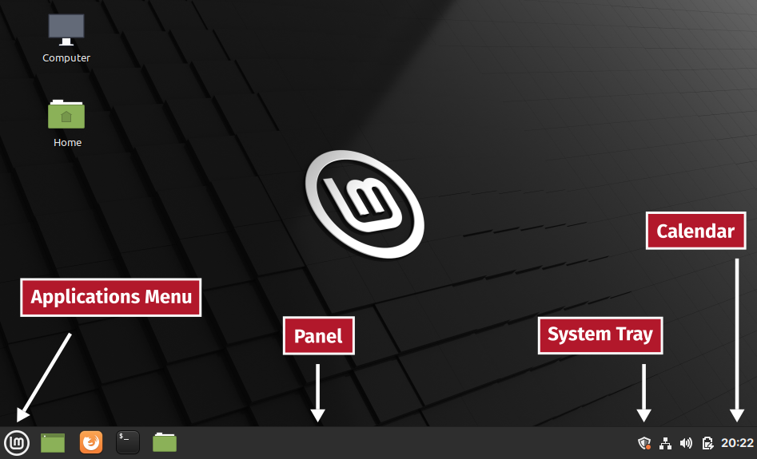

.. _applications-menu:

The Cinnamon desktop
====================
In its default configuration, the Cinnamon desktop
includes the following components (:numref:`fig-231a`):

:guilabel:`Applications Menu`
   — search and launch installed applications, logout, 
   shutdown or restart system.

:guilabel:`Panel`
   — launch pinned applications, manage open
   applications windows.

:guilabel:`System Tray`
   — contains applets for managing the network,
   sound, power, software updates etc.,

:guilabel:`Calendar`
   — provides current date and time, and a calendar.

.. _fig-231a:

   Components of the Cinnamon desktop

