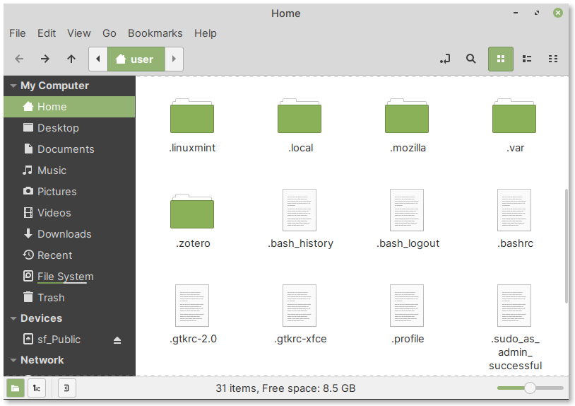

Hidden files and directories
============================
In addition to the default directories mentioned 
earlier, there are hidden files and directories 
in home directory (:numref:`fig-251b`).
They have a dot (``.``) character at the beginning of
their file name.

.. _fig-251b:

   Hidden files and directories in home directory

You can view (or hide) these files using the 
following menu entry in file manager:

:menuselection:`View --> Show Hidden Files`

Alternatively, you can use the ``Ctrl + h`` keyboard 
shortcut.

