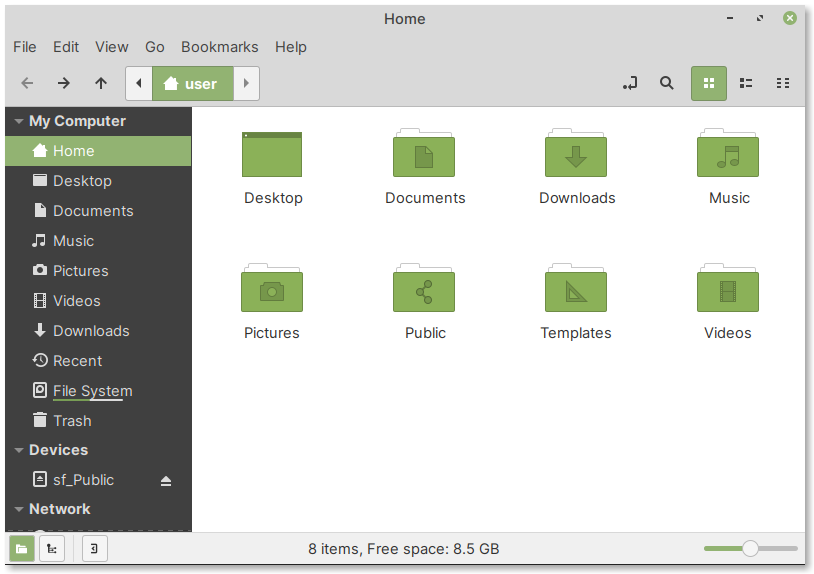

.. index:: Files

Your home directory
===================
When you log in to the desktop and open 
:doc:`Files <../applications/files>`, it will display your 
home directory (:numref:`fig-25a`). 

The following directories will be present in your home 
directory by default:
Desktop, Documents, Downloads, Music, Pictures,
Public, Templates, and Videos.

.. _fig-25a:

   Home directory
   
Notes
-----
/home/user
..........
The complete (or absolute) path to your home 
directory will be of the form ``/home/user``, 
where ``user`` is your username on the system.

.. _dollar-home:

$HOME
.....
The ``HOME`` environment variable will automatically be
set to the complete path to your home directory in the 
filesystem. 

Hence, you can substitute ``/home/user`` with ``$HOME`` 
in your commands or scripts.
