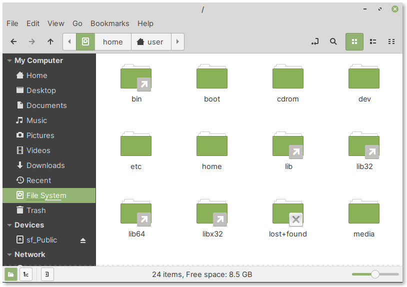

Accessing the root filesystem
=============================
To access the root filesystem (``/``), click on
:guilabel:`File System` in the sidebar of
file manager (:numref:`fig-254a`).

.. _fig-254a:

   Click on File System entry to access the 
   root filesystem
   
Directories under ``/`` and their functions
-------------------------------------------

``/etc``
   ­— stores configuration files of applications
``/home``
   ­— contains home directories of users
``/media``
   ­— locations where devices like external disks will be
   mounted i.e., made available
``/root``
   ­— home directory of ``root`` user (administrator)
``/tmp``
   ­— temporary files created by applications
``/usr``
   ­— applications and libraries are installed
   here along with their data and documentation
``/var``
   ­— storage for log files, application cache,
   databases etc.,
   
Root file system and root home directory are different
------------------------------------------------------
``/`` is the root filesystem
............................
All users on the system can access files and directories 
here, provided they have the appropriate permissions.

``/root`` is home directory of root
....................................
Only root will have access to it.

