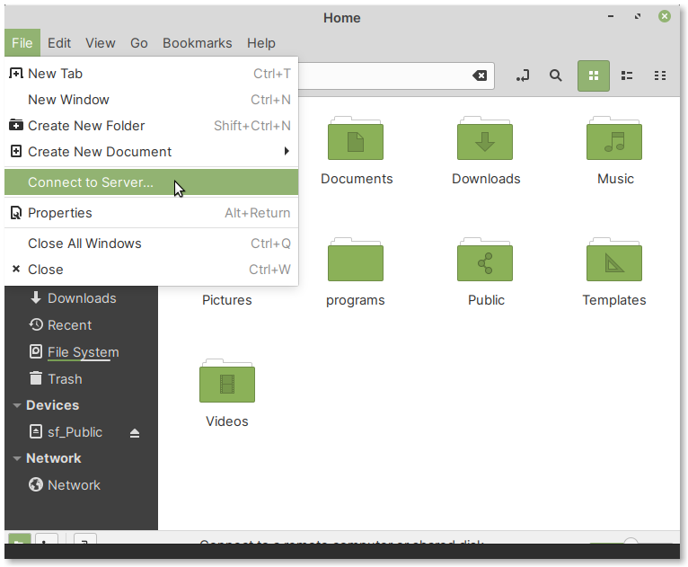
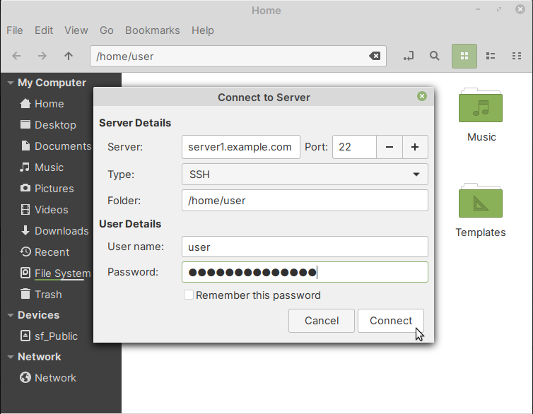

.. index:: Files

Transferring files between systems
==================================
One useful feature of Files is the ability to connect to 
remote systems using protocols like SSH, FTP, SMB and 
Webdav. Once connected, you can transfer files from your 
Linux desktop to the remote system or *vice-versa*.

To connect to a remote system, use the following menu 
entry in Files (:numref:`fig-255a`):

:menuselection:`File --> Connect to Server`

.. _fig-255a:

   Connect to Server option in Files

Connecting to an SSH server
---------------------------
Open :menuselection:`File --> Connect to Server` and 
follow the steps below (:numref:`fig-255b`):

1. In the field corresponding to :guilabel:`Server`, 
   enter the domain name or IP address of the server you 
   are connecting to
2. Port 22 is the default for SSH, so you do not need to
   change that usually
3. From the :guilabel:`Type` drop-down box, select SSH
4. Under :guilabel:`Folder`, you can specify a 
   directory (optional) to open, once connection 
   is successful
5. Enter the username and password of your account 
   *on the server*
6. Click on the :guilabel:`Connect` button

.. _fig-255b:

   Connecting to an SSH server
   
Once the remote directory is open in Files, you can start
transferring files from your desktop or *vice-versa*.

