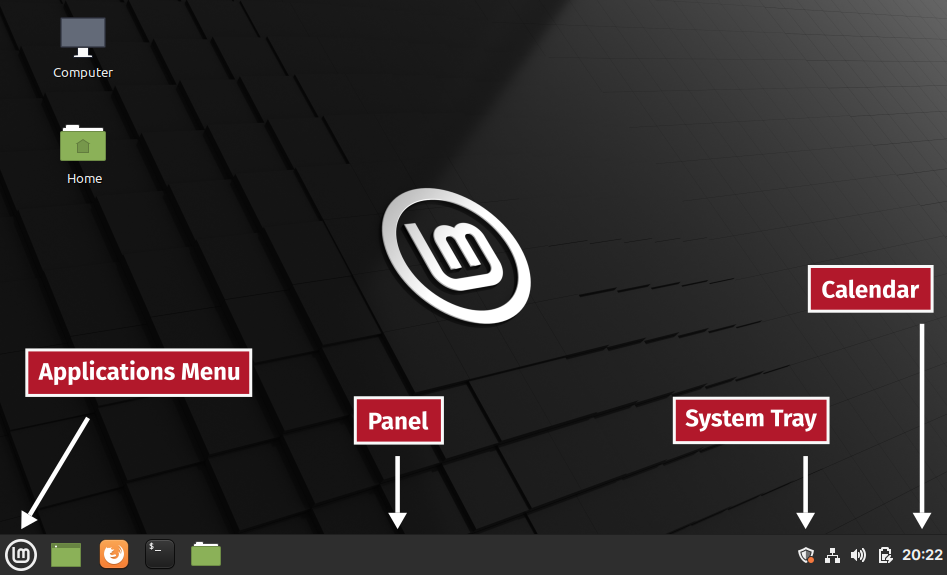

The Desktop
===========
When you log in, you will be placed in the default
desktop environment. In the case of Linux Mint, this is
:term:`Cinnamon`.

.. note::

   If you are using the virtual machine image distributed
   with this book, the default user account for logging
   in to the virtual machine, is:

   | Username: ``user``
   | Password: ``user``

In its default configuration, the Cinnamon desktop
includes the following components (:numref:`fig-231a`):

.. _applications-menu:

:guilabel:`Applications Menu`
   — search and launch installed applications, logout,
   shutdown or restart system.

:guilabel:`Panel`
   — launch pinned applications, manage open
   applications windows.

:guilabel:`System Tray`
   — contains applets for managing the network,
   sound, power, software updates etc.,

:guilabel:`Calendar`
   — provides current date and time, and a calendar.

.. _fig-231a:

   Components of the Cinnamon desktop

