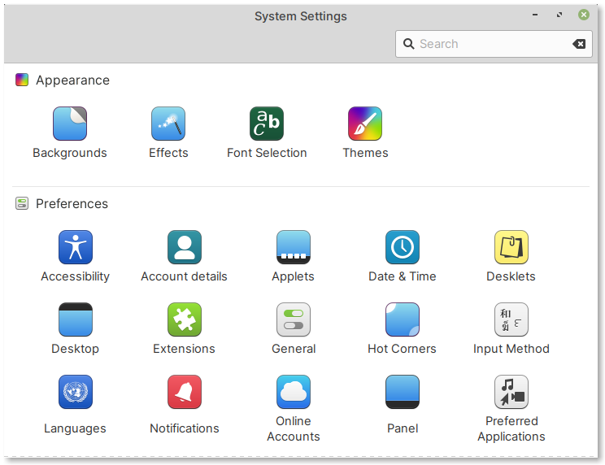
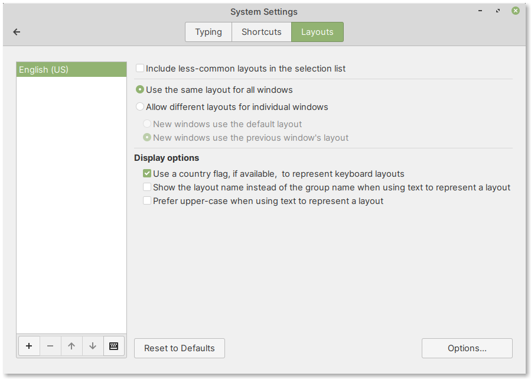
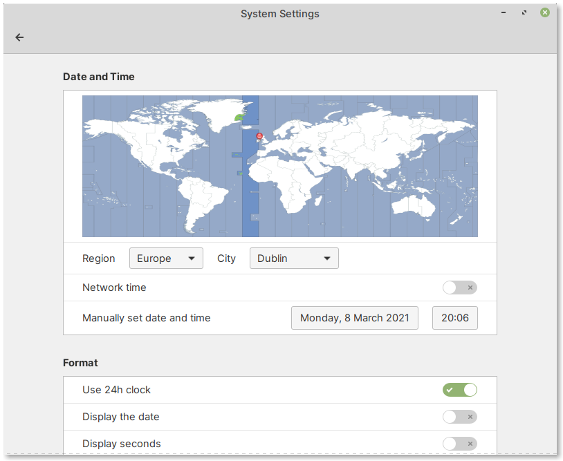

.. index:: System Settings

Changing system settings
========================
The :guilabel:`System Settings` application can be used to
customize the desktop, the operating system and hardware
(:numref:`fig-232a`).

You can launch it from the applications' menu.

.. _fig-232a:

   System Settings application

The settings you can configure here include accessibility,
user accounts, date and time, keyboard layout, language,
network, display and more.

.. index:: System Settings; Keyboard Layout

Changing keyboard layout
------------------------
The default keyboard layout of the virtual machine is
:guilabel:`English (US)`.

You can change this under:

:menuselection:`Hardware --> Keyboard --> Layouts`

   Keyboard layouts in System Settings

.. index:: System Settings; Date and Time

Changing system date and time
-----------------------------
The system date and time can be updated by selecting:

:menuselection:`Preferences --> Date and Time`

   Date and time settings

