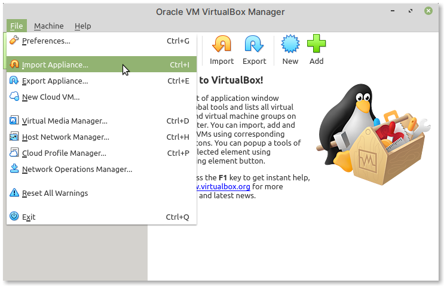
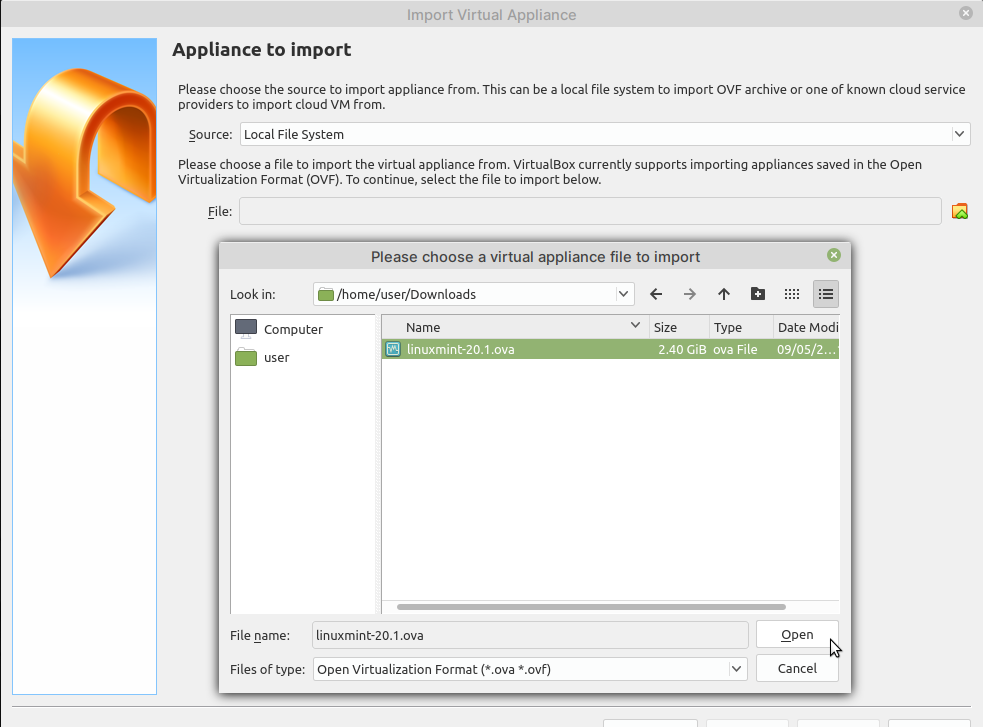
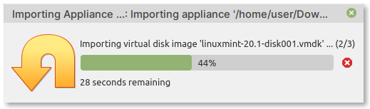

Importing the virtual machine image
===================================
Open VirtualBox on your computer and then follow the steps 
below to import the downloaded virtual machine image.

Step 1 — Select OVA file
------------------------
From the main window of VirtualBox, select:

:menuselection:`File --> Import Appliance` (:numref:`fig-222a`)

.. _fig-222a:

   Select File --> Import Appliance from the menu
   
In the :guilabel:`Appliance to import` screen, click on the 
button that appears next to the :guilabel:`File` entry field
(:numref:`fig-222b`).

.. _fig-222b:

   Click on the button that appears next to the 
   File entry field

Browse to the location of the ``linuxmint-20.1.ova`` 
file, select it, and then click on the :guilabel:`Open` 
button.
   
The :guilabel:`File` entry field will now have the 
complete path to the selected file (:numref:`fig-222c`).

.. _fig-222c:

.. figure:: images/virtualbox-import-proceed.png

   Click on the Next button to proceed
   
Click on the :guilabel:`Next` button to proceed.

Step 2 — Adjust appliance settings (optional)
---------------------------------------------
In the next screen — :guilabel:`Appliance settings`
(:numref:`fig-222d`), you can modify the configuration 
of this virtual machine. 

.. note::
   
   *This step is optional*. 
   
   You can click on the :guilabel:`Import` button at the 
   bottom to proceed to the 
   :ref:`next step <vm-import-progress>`.

For example, you can add more CPU or RAM for this
virtual machine, depending on the configuration of your 
computer. 

.. _fig-222d:

.. figure:: images/virtualbox-appliance-settings.png

   Appliance settings screen

Click on the :guilabel:`Import` button to proceed. 

.. _vm-import-progress:

Step 3 — Import progress and completion
---------------------------------------
You will notice a progress bar at this stage 
(:numref:`fig-222e`).

.. _fig-222e:

   Virtual machine import progress

When import is complete, you will be taken back to 
the main window of VirtualBox. 

The imported virtual machine — :guilabel:`LinuxMint 20.1`, 
will appear in the panel on the left (:numref:`fig-222f`). 

.. _fig-222f:

.. figure:: images/virtualbox-imported-vm.png

   Imported virtual machine

