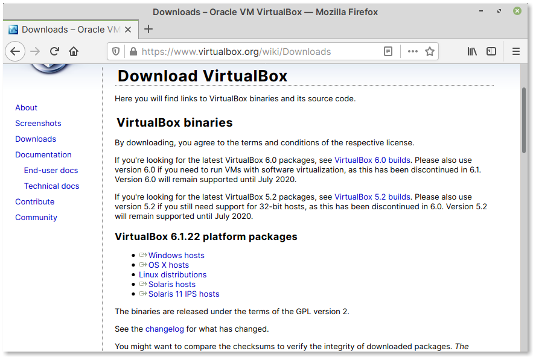

Requirements
============

VirtualBox installed on your computer
-------------------------------------
You can install VirtualBox by following the
instructions below depending on your
operating system.

.. attention::

   *Installing software will require administrator
   privileges.*

Instructions for macOS and Windows
..................................
You can download an installer for macOS or Windows
from the `Downloads <https://www.virtualbox.org/wiki/Downloads>`__
section of the VirtualBox website (:numref:`fig-221a`).

.. _fig-221a:

   VirtualBox downloads page

Instructions for Linux distributions
....................................
Most Linux distributions include VirtualBox in their
package repositories. It is recommended you install it
using your package manager like :term:`Synaptic` or
:term:`apt`, dnf etc.,

For example, to get VirtualBox working on Ubuntu 20.04 LTS,
you will need to install the ``virtualbox`` and
``virtualbox-guest-additions-iso`` packages.

.. note::

   If you cannot install from repositories,
   you can download an installer from the
   `Linux Downloads <https://www.virtualbox.org/wiki/Linux_Downloads>`__
   section of the project website.

Virtual machine image of Linux Mint
-----------------------------------
A virtual machine image of Linux Mint is distributed along
with this e-book. You can can download it from SourceForge,
using the link below.

**Download**: `linuxmint-20.1.ova`_

It is distributed as an :term:`OVA` format file.

In the page that appears, click on the
``linuxmint-20.1.ova`` link. This will download the
file to your computer.

.. links

.. _linuxmint-20.1.ova: https://sourceforge.net/projects/linuxforbiologists/files/linuxmint-20.1/
