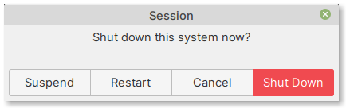

Stopping the virtual machine
============================
When your work is complete, you can shut down the 
virtual machine by clicking on the :guilabel:`Quit` button 
in Linux Mint's :guilabel:`Applications Menu`. 

This will display a confirmation
dialog (:numref:`fig-224a`).

.. _fig-224a:

   Confirmation dialog for system shutdown

Click on the :guilabel:`Shut Down` button to stop 
the virtual machine.
