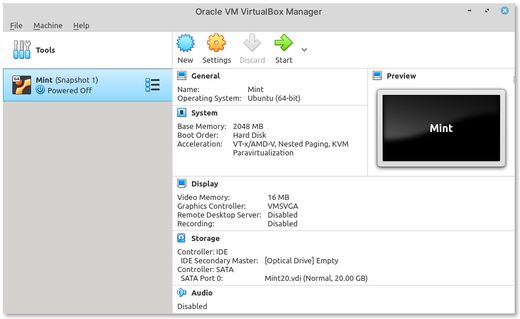

.. index:: VirtualBox

Running a Linux virtual machine
===============================
To run virtual machines of other operating systems
(guests) on your computer (host), you will need to
first install a *hypervisor* — software that runs
virtual machines.

Examples of hypervisors include VirtualBox, Parallels,
VMware Workstation etc., I will use VirtualBox in this book
(:numref:`fig-22a`).

.. _fig-22a:

   Main window of VirtualBox
   

.. toctree::
   :maxdepth: 1
   
   requirements
   import
   start
   stop

