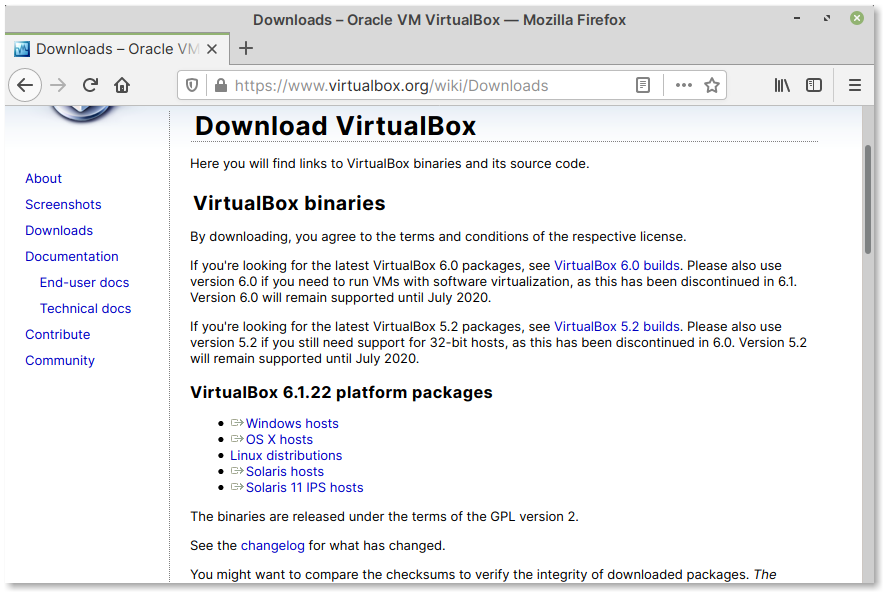

Requirements
============
   
VirtualBox installed on your computer
-------------------------------------
You can install VirtualBox by following the 
instructions below depending on your 
operating system.

.. attention::

   *Installing software will require administrator 
   privileges.*

Instructions for macOS and Windows
..................................
You can download an installer for macOS or Windows 
from the `Downloads <https://www.virtualbox.org/wiki/Downloads>`__
section of the VirtualBox website (:numref:`fig-221a`).

.. _fig-221a:

   VirtualBox downloads page

Instructions for Linux distributions
....................................
Most Linux distributions include VirtualBox in their
package repositories. It is recommended you install it
using your package manager like :term:`Synaptic` or
:term:`apt`, dnf etc.,

For example, to get VirtualBox working on Ubuntu 20.04 LTS, 
you will need to install the ``virtualbox`` and 
``virtualbox-guest-additions-iso`` packages.

.. note::

   If you cannot install from repositories,
   you can download an installer from the
   `Linux Downloads <https://www.virtualbox.org/wiki/Linux_Downloads>`__
   section of the project website.

Virtual machine image of Linux Mint
-----------------------------------
You can download a ready-to-use virtual machine image
of Linux Mint 20.1 from the website of this
book:

https://vimalkvn.com/linuxforbiologists

It is distributed as an :term:`OVA` format file.

Click on the download link and save the 
``linuxmint-20.1.ova`` file to your computer.

