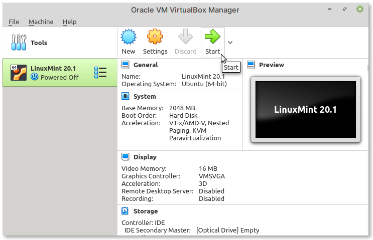
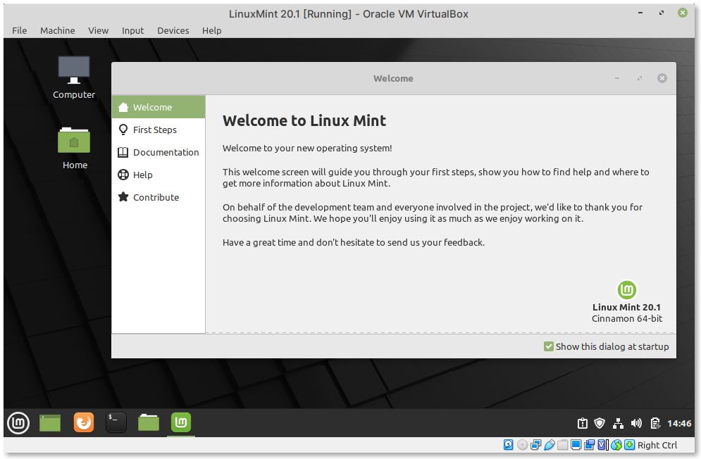

Starting the virtual machine
============================
To start the virtual machine, select 
:guilabel:`LinuxMint 20.1` and then click on 
the :guilabel:`Start` button in the main toolbar 
(:numref:`fig-223a`).

.. _fig-223a:

   Start virtual machine

Once the boot process is complete, you will be logged
in directly to the desktop (:numref:`fig-223b`).

.. _fig-223b:

   The Linux Mint desktop
   
For reference, the default username is 
``user`` and password is also ``user``.

