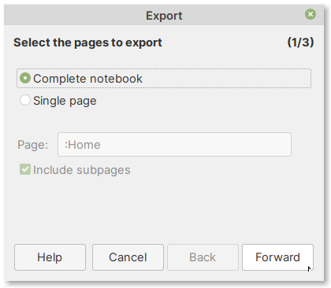
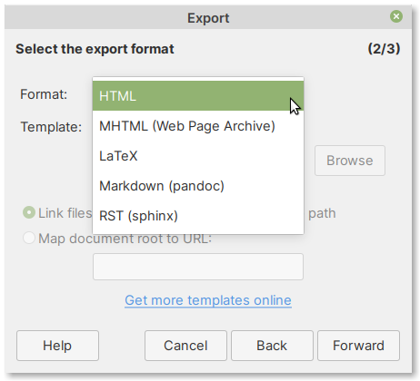
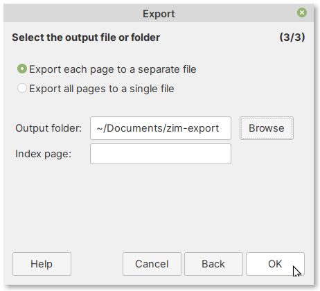
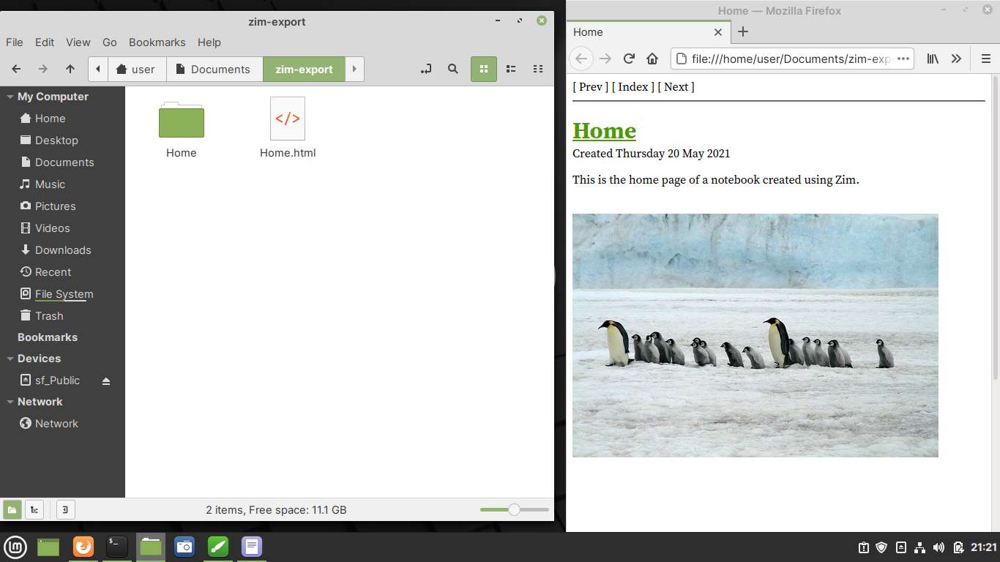

Exporting notes and notebooks
=============================
To export the notebook or a page, select:

:menuselection:`File --> Export`

In the dialog window that appears, 
select the desired option and click on the 
:guilabel:`Forward` button (:numref:`fig-625a`).

.. _fig-625a:

   Export notebook
   
In the next screen, you can select the format of the 
exported notebook or page in the :guilabel:`Format`
drop-down box (:numref:`fig-625b`).
   
.. _fig-625b:

   Select an export format
   
You can leave it at the default — HTML. 
Click on the :guilabel:`Forward` button to proceed.

In the final screen, select a directory to save the
exported notebook or page. 

.. note::
   
   If you are using the defaults, it is a good idea 
   to create a new output directory and select it under 
   :guilabel:`Output folder`.

Click on the :guilabel:`OK` button complete export.
   
.. _fig-625c:

   Select an output folder

When complete, open the output directory in file 
manager. 

*Double-click* on :guilabel:`Home.html`
to open it in the browser (:numref:`fig-625d`).

.. _fig-625d:

   Viewing exported notebook

