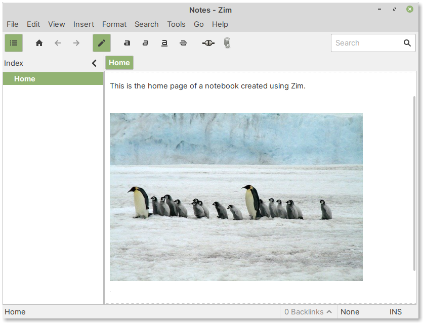
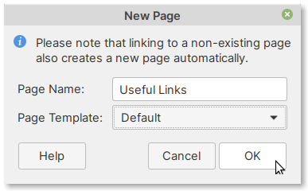

Taking notes
============
The :guilabel:`Home` page is the main page of a notebook. 

You can start typing your notes here. Zim saves changes
automatically.

Basic text formatting
---------------------
Formatting text in Zim is similar to that of
word processor programs. 

You can use the :guilabel:`Format` menu bar 
entry and select the desired option (:numref:`fig-624a`).

.. _fig-624a:

.. figure:: images/zim-format.png

   Options for formatting text

Keyboard shortcuts
..................
Alternatively, you can use keyboard shortcuts to 
apply formatting to your text. 

For example:

**Bold** : ``Ctrl + b``

*Italic* or *Emphasis* : ``Ctrl + i``

:sup:`Superscript` : ``Ctrl + Shift + p``

:sub:`Subscript` : ``Ctrl + Shift + b``

For headings, use:

Heading 1: ``Ctrl + 1``

Heading 2: ``Ctrl + 2``

Heading 3: ``Ctrl + 3``

Heading 4: ``Ctrl + 4``

Heading 5: ``Ctrl + 5`` 

Inserting images
----------------
To insert an image, you can select the following option 
from the menu bar:

:menuselection:`Insert --> Image`

In the dialog that opens, browse to the directory containing
your image and then select the image (:numref:`fig-624b`).

.. _fig-624b:

.. figure:: images/zim-insert-image.png

   Insert image. Check Attach image first option

Check the :guilabel:`Attach image first` option. This 
will copy the image to your notebook directory.

Click on the :guilabel:`Open` button to insert the image
(:numref:`fig-624c`).

.. _fig-624c:

.. figure:: images/zim-inserted-image.png

   Image inserted into current page

Resizing an image
.................
If you would like to resize the image, *right-click* on 
the image and select :guilabel:`Edit Properties` 
(:numref:`fig-624d`).

.. _fig-624d:

.. figure:: images/zim-image-edit-properties.png

   Edit image properties

In the dialog window that opens, change either the
:guilabel:`Width` or the :guilabel:`Height` of the image 
to the desired size and click on the :guilabel:`OK` button
(:numref:`fig-624e`).

.. _fig-624e:

.. figure:: images/zim-image-resize.png

   Change the width or height of the image
   
The image will now be resized (:numref:`fig-324f`).

.. _fig-324f:

   Resized image

Adding more pages
-----------------
To add more pages, select the following option from
the menu bar (:numref:`fig-624g`):

:menuselection:`File --> New Page`

.. note:: 
   
   You can also *right-click* on a page in the 
   :guilabel:`Index` view and select the
   :guilabel:`New Page Here` option.

.. _fig-624g:

.. figure:: images/zim-new-page.png

   Adding a new page
   
Enter a name for the page in the :guilabel:`New Page` dialog 
window (:numref:`fig-624h`) and click on the :guilabel:`OK`
button.

.. _fig-624h:

   Enter a name for the new page
   
The new page will appear in the :guilabel:`Index` view
(:numref:`fig-624i`).

.. _fig-624i:

.. figure:: images/zim-new-page-added.png

   Newly added page

   
Adding subpages
...............
A subpage will be placed under an *existing* page. 

To add a new subpage:

1. Select an existing page in :guilabel:`Index` view 
2. Select :menuselection:`File --> New Sub Page` from the 
   menu bar
3. Enter a name for the page and click on the 
   :guilabel:`OK` button
   
Deleting or renaming pages
--------------------------
To delete or rename pages, you can *right-click* on 
the page and select the desired function.

